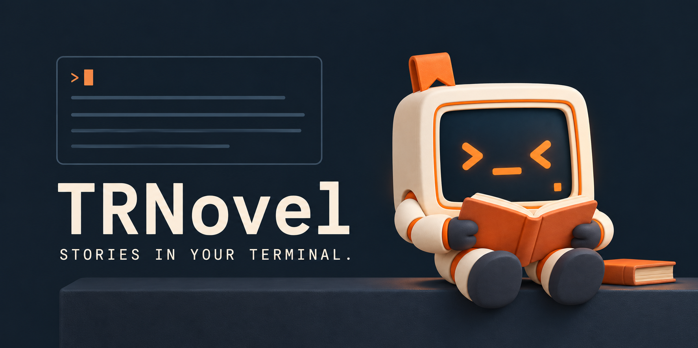

<div align="center">
  <a href="https://yexiyue.github.io/TRNovel/">
    <picture>
      <source media="(prefers-color-scheme: dark)" srcset="assets/brand/wordmark-on-dark.svg">
      <source media="(prefers-color-scheme: light)" srcset="assets/brand/wordmark-on-light.svg">
      
    </picture>
  </a>

  <p><strong>打开终端，走进故事。</strong></p>
  <p>用键盘翻页，从上次的位置继续。读累了，就让小卷陪你听。</p>

  <p>
    <a href="https://crates.io/crates/trnovel"></a>
    <a href="https://www.npmjs.com/package/@trnovel/trnovel"></a>
    <a href="LICENSE"></a>
  </p>

  

  <p>
    <a href="https://yexiyue.github.io/TRNovel/guides/intro/">使用指南</a> ·
    <a href="https://yexiyue.github.io/TRNovel/book-source/intro/">书源参考</a> ·
    <a href="https://github.com/yexiyue/TRNovel/releases">下载发行版</a> ·
    <a href="assets/brand/README.md">品牌与吉祥物</a>
  </p>
</div>

## 从终端开始阅读

TRNovel 是用 Rust 构建的终端小说阅读器，支持 Windows、macOS 和 Linux。你可以打开本地 TXT，也可以导入网络书源，在同一个界面里选书、浏览目录和阅读正文。

阅读进度留在本地，键位可以按习惯调整。主题、背景、段落间距和翻页重叠行数也可以配置，让终端成为适合长时间阅读的地方。

| 你想做什么 | TRNovel 提供什么 |
| --- | --- |
| 读本地小说 | UTF-8 / GBK 识别，卷、章目录解析，自定义目录规则 |
| 从上次继续 | 历史记录、阅读进度保存，`trn -q` 续读 |
| 找到某段正文 | 章内搜索、匹配高亮和前后跳转 |
| 按习惯翻页 | 可配置键位、主题、背景模式和阅读布局 |
| 读网络小说 | 搜索、分类、详情、目录和正文；结构化 v2 书源 |
| 制作新书源 | Agent skill 探站生成，`trn doctor` 校验，`trn import` 导入 |
| 听小说 | 独立 `talechime` 程序，MOSS 流式合成与音色导入，可选 Qwen / VoxCPM2 / OmniVoice；正文高亮和跟随朗读 |

<details>
<summary>看看真实阅读界面</summary>


</details>

## 安装

macOS / Linux：

```sh
curl --proto '=https' --tlsv1.2 -LsSf https://github.com/yexiyue/TRNovel/releases/latest/download/trnovel-installer.sh | sh
```

Windows：

```powershell
powershell -ExecutionPolicy Bypass -c "irm https://github.com/yexiyue/TRNovel/releases/latest/download/trnovel-installer.ps1 | iex"
```

也可以选择包管理器：

```sh
cargo install trnovel
npm i -g @trnovel/trnovel
brew install yexiyue/tap/trnovel
```

这些命令安装最新正式版本。当前源码已统一为默认支持听书的单一阅读器；新发行流程尚未创建应用 release tag，已有正式安装包不会因此改变。旧 basic、捆绑 worker、加速及 ARM64 musl 专用包停止更新。见[安装文档](https://yexiyue.github.io/TRNovel/guides/install/)。

## 开读

```sh
trn               # 打开主界面
trn -l ./novels   # 从本地小说目录进入
trn -n            # 进入网络小说模式
trn -q            # 继续上次阅读
trn -H            # 查看历史记录
```

`trn` 和 `trnovel` 是同一个阅读器的两个命令名。进入阅读页后，可以打开阅读设置和快捷键帮助；默认键位及自定义方式见[阅读指南](https://yexiyue.github.io/TRNovel/guides/read/)与[键位配置](https://yexiyue.github.io/TRNovel/guides/keybindings/)。

## 让 AI 帮你做书源

给你的 Agent 安装 [`booksource-generator`](skills/booksource-generator/SKILL.md)：

```sh
npx skills add https://github.com/yexiyue/TRNovel/tree/main/skills/booksource-generator
```

然后把站点地址交给它：

```text
请使用 booksource-generator skill，为 https://example.com 生成一个 TRNovel v2 书源。
生成后运行 trn doctor 校验，修到通过后把 JSON 给我。
```

拿到书源后，先检查再导入：

```sh
trn doctor ./my-source.v2.json
trn import ./my-source.v2.json
trn -n
```

书源使用 `trnovel-booksource/v2` 结构化 JSON，包含请求、提取规则与验证样例。支持 CSS、XPath、JSONPath、正则，以及解码、加解密、签名和文字转换；部分站点可使用 JS 或浏览器辅助。站点变化后，仍需重新校验和调整规则。

- [JSON Schema](skills/booksource-generator/references/book-source.schema.json)
- [真实书源示例](skills/booksource-generator/references/example-bilixs.v2.json)
- [规则语法](https://yexiyue.github.io/TRNovel/book-source/rules/)
- [反爬与浏览器辅助](https://yexiyue.github.io/TRNovel/reference/anti-scraping/)

TRNovel 不直接接受 Legado 书源 JSON。

## 让小卷读给你听


听书引擎由独立项目 [Talechime · 叙铃](https://github.com/yexiyue/talechime) 提供，需独立安装并加入 PATH。阅读器只依赖 crates.io 的 `talechime-protocol 0.1.0`，通过 JSON Lines v5 通信，无需子模块或相同应用版本。普通阅读无需安装 Talechime。

默认后端是 MOSS-TTS-Nano，支持流式合成和 WAV 参考音色导入；Qwen3-TTS、VoxCPM2 与 OmniVoice 可按 feature 编入。Qwen 提供九种预置音色，CPU / Metal 支持取决于构建与平台，主观音质验收仍在进行。

阅读页默认按 `P` 播放或暂停，`T` 打开听书设置，`f` 回到朗读位置并恢复跟随。手动滚动或搜索会暂时解除跟随；播放失败保留恢复点，等待你主动重试。

模型按需下载到 `~/.talechime/resources/`。逐句对齐默认关闭，开启后会准备额外模型。完整说明见[听书指南](https://yexiyue.github.io/TRNovel/guides/tts/)。

## 从源码构建

需要 Rust 1.89 或更新版本。Linux 阅读器需要 OpenSSL 开发库和 pkg-config，Talechime 另需 ALSA 开发库。

```sh
git clone https://github.com/yexiyue/TRNovel.git
cd TRNovel
cargo build --release --locked -p trnovel --bins
```

Talechime 的源码构建和独立安装见[项目 README](https://github.com/yexiyue/talechime#installation)。worker 查找顺序为 `--tts-program`、`~/.trnovel/config.toml` 中的 `[tts].program`、PATH 中的 `talechime`。指定路径无效会直接报错；缺少程序显示安装链接，不自动下载或更新。

开发入口与质量检查见 [AGENTS.md](AGENTS.md)。文档站位于 `docs/`：

```sh
cd docs
pnpm install --frozen-lockfile
pnpm dev
```

## 认识小卷


小卷是 TRNovel 的方形终端机器人。屏幕上的 `> <` 是眼睛，`_` 是嘴角，小小的方块光标陪着故事向前。它会陪你选书、翻页，也会戴上耳机听下一章。

新品牌围绕终端展开：墨蓝屏幕、纸白机身、暖橙光标，字标使用等宽字体。标志与小卷共享同一张屏幕脸；品牌文件、透明背景形象与使用规范集中在 [`assets/brand/`](assets/brand/README.md)。

<br clear="all">

## 内容与数据

TRNovel 不提供或托管小说内容，网络小说由你配置的书源提供。请支持正版，并确认所访问内容及书源符合适用要求。

阅读设置保存在 `~/.trnovel/config.toml`，持久数据在 `~/.trnovel/data/`，可重建缓存在 `~/.trnovel/cache/`。Talechime 的配置、恢复点和模型分别位于 `~/.talechime/config.json`、`checkpoints/`、`resources/`。新版不读取或自动迁移旧目录，见[手工搬迁说明](https://yexiyue.github.io/TRNovel/guides/migration/)。网络阅读会请求所选站点；模型准备会访问对应下载服务。

## License

项目使用 [MIT](LICENSE) 许可。随品牌资产保留的 IBM Plex Mono 字体使用 [SIL Open Font License](assets/brand/fonts/OFL.txt)。
