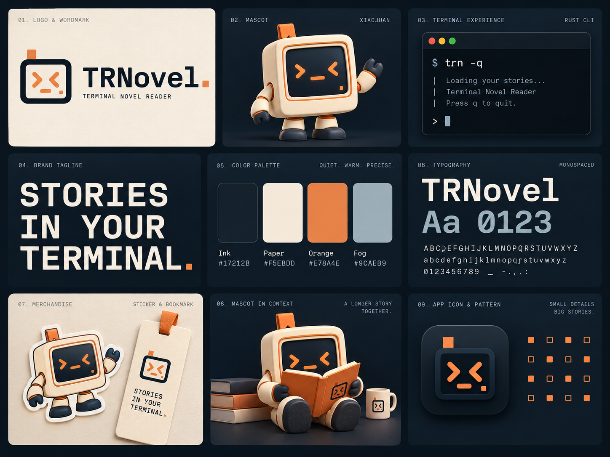

# TRNovel · 终端里的故事伙伴



## 品牌方向

TRNovel 是终端小说阅读器。品牌以方形终端为核心：命令行符号构成表情，光标代表继续阅读，机身上的书签连接小说与终端。

- 中文主张：**打开终端，走进故事。**
- 英文主张：**Stories in your terminal.**
- 气质：清楚、安静、亲切，有终端工具的秩序，也有陪读的温度。
- 标志：从吉祥物的屏幕脸提炼；`> <`、`_` 与方块光标组成统一识别。

这套资产是当前唯一使用的品牌方案。旧标志与字标已从工作区移除；真实产品演示录屏继续作为功能说明。

## 吉祥物：小卷 / Xiaojuan

  

小卷的机身就是一台小终端。它用屏幕上的符号表达心情，陪读时捧书，听书时戴上耳机。

识别特征：纸白方形机身、墨蓝内嵌屏幕、暖橙边缘、相向的尖括号眼睛、下划线嘴、右下角方块光标、左上角橙色书签、短而厚实的手脚。造型采用哑光材质和柔和灯光。

制作新姿态时以 `mascot-xiaojuan.png` 为角色参考，保留这些特征。书和耳机是应用场景中的道具，不改变屏幕脸的基本结构。

## 色彩

| 名称 | 色值 | 使用 |
| --- | --- | --- |
| 墨蓝 / Ink | `#17212B` | 屏幕、深色底、浅色背景上的文字与标志 |
| 纸白 / Paper | `#F5EBDD` | 机身、浅色品牌底、深色背景上的字标 |
| 暖橙 / Cursor | `#E78A4E` | 光标、屏幕表情、吉祥物细节、深色主题强调 |
| 雾蓝 / Fog | `#9CAEB9` | 深色背景上的辅助信息 |
| 深橙 / Accessible orange | `#BC5A28` | 浅色背景上的强调文字和按钮 |

暖橙用于图形；浅色页面的正文链接与主按钮使用深橙，以保持文字对比度。大面积背景以墨蓝或纸白为主。

## 字体与字标

字标使用 **IBM Plex Mono Medium**，统一为 `TRNovel`，大小写保持不变。正式 SVG 字标已转成路径，不依赖访问者安装字体。

网页正文使用系统字体，代码使用系统等宽字体；无需加载远程字体。源字体与 SIL Open Font License 保存在 `fonts/`。

## 资产清单

| 文件 | 用途 |
| --- | --- |
| [mark-on-light.svg](mark-on-light.svg) | 浅色背景上的矢量标志 |
| [mark-on-dark.svg](mark-on-dark.svg) | 深色背景上的矢量标志 |
| [wordmark-on-light.svg](wordmark-on-light.svg) | 浅色背景上的完整字标 |
| [wordmark-on-dark.svg](wordmark-on-dark.svg) | 深色背景上的完整字标 |
| [app-icon.svg](app-icon.svg) / [app-icon.png](app-icon.png) | 方形图标；PNG 为 512 × 512 |
| [mascot-xiaojuan.png](mascot-xiaojuan.png) | 欢迎主形象，透明 PNG |
| [mascot-reading.png](mascot-reading.png) | 阅读姿态，透明 PNG |
| [mascot-listening.png](mascot-listening.png) | 听书姿态，透明 PNG |
| [readme-cover.png](readme-cover.png) | README 横幅与分享图源文件 |
| [brand-board.png](brand-board.png) | 品牌应用概念总览；不是产品截图 |
| [PROMPTS.md](PROMPTS.md) | 生成工具、提示词与新形象参考关系 |
| [source/build_vectors.py](source/build_vectors.py) | 标志、路径字标与 favicon 构建源 |
| [source/export_images.mjs](source/export_images.mjs) | PNG 图标和官网分享图导出 |

官网直接引用本目录中的主资产。`docs/public/favicon.svg` 与 `docs/public/brand/social-card.png` 是为公开 URL 导出的文件。

## 使用规范

- 标志最小建议显示尺寸为 24 px；16 px 场景使用专门简化的 favicon。
- 完整字标建议宽度至少 220 px，并在四周留出一个光标宽度的空间。
- 根据背景选择 `on-light` / `on-dark` 版本，保持比例，不给 SVG 添加阴影或描边。
- 小卷的透明 PNG 可以放在墨蓝、纸白或页面背景上。保留完整机身与书签，避免裁去眼睛、手脚或道具。
- 品牌应用总览用于说明视觉方向。正式标志与色值以 SVG 和本文件为准。

## 重建导出

在安装了 `fonttools` 的 Python 环境中运行：

```sh
python3 assets/brand/source/build_vectors.py
```

安装文档站依赖后，从仓库根目录运行：

```sh
node assets/brand/source/export_images.mjs
```

图像使用内置 `image_gen` 生成，透明背景原样保留；导出脚本只转换格式和尺寸。生成图像的提示词见 [PROMPTS.md](PROMPTS.md)。

## 字体来源与许可

IBM Plex Mono 源字体取自 [Google Fonts 仓库](https://github.com/google/fonts/tree/main/ofl/ibmplexmono)，使用 [SIL Open Font License](fonts/OFL.txt)。项目许可见根目录 [LICENSE](../../LICENSE)。
