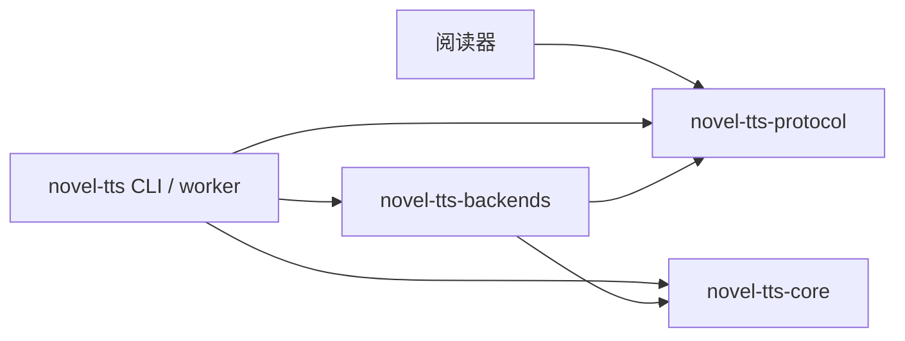

# novel-tts-backends

具体模型实现和资源目录。会话、播放和检查点由 `novel-tts-core` 管理；CLI/worker 通过 `Registry` 组装，阅读器不依赖本 crate。



## 编译组合

```sh
cargo build -p novel-tts                                  # MOSS 默认
cargo build -p novel-tts --features kokoro                # 两个后端
cargo build -p novel-tts --no-default-features --features kokoro
```

`Registry` 暴露已编译后端的能力、默认音色及显示名称，按需准备一个模型。后端扩展实现 core 的 `Backend::stream` 和 `Backend::segments`，无需改变播放器或阅读器。

## MOSS

CPU ONNX 推理在独立线程执行。通道容量为 1；消费者丢弃流后，生成在推理步骤之间终止。SentencePiece 按 50 token / 60 个 CJK 字符预算合并相邻句子，超限优先在句末分段，保存原文范围，合成副本执行空白/标点规范化。首版不引入官方 Python 可选的 WeText 数字规范化包。

资源位于 `~/.novel-tts/moss/{tts,codec}`，自定义音色位于 `moss/voices`。`--model-dir` 覆盖的是公共根目录，其子目录分别为 moss 和 kokoro。

固定资源清单位于 `src/moss/assets/resources.json`，每个文件记录下载 URL、大小和 SHA-256：

- TTS：OpenMOSS-Team/MOSS-TTS-Nano-100M-ONNX，revision `f52645cb467506d8e18e746ddd59482685b74e58`。
- Codec：OpenMOSS-Team/MOSS-Audio-Tokenizer-Nano-ONNX，revision `ceff0d0749bfb3fa2d61149794ec6feef0d1e1ae`。
- 总下载约 763 MB，包含 ONNX 外部权重。模型只在实际准备时下载；损坏文件隔离为 `.corrupt`，重新准备会补下载。

参考 WAV 支持 1..30 秒非静音 mono/stereo PCM 或 float，内部使用 sinc 重采样至 48kHz stereo。自定义 ID 使用 `custom:<name>`，缓存模型 revision 和编码结果；重复 ID 拒绝覆盖，升级模型后需重新导入。CLI 导入后重新连接阅读器即可刷新音色目录。

## 原生验收

```sh
cargo run -p novel-tts-backends --example moss -- <root>/moss output.wav '你好，欢迎使用听书功能。'
# 第三个参数也可使用 @文本文件；第四个参数指定音色
TRNOVEL_MOSS_MODEL_DIR=<root>/moss cargo test -p novel-tts-backends
```

普通测试不下载模型；设置环境变量后才执行真实模型的官方数值对照和取消测试。官方参考 fixture 来自 upstream commit `8b7bcc9341b3b4ef3a3a58ba1338a7d85ff133eb` 的 `ort_cpu_runtime.py`，使用官方 fixed sampling 图、三个 codec frame 一块和 seed=42 的固定 LCG 随机数序列。fixture 包含 SentencePiece tokens、样本数和跨音频范围的 512 个 PCM 探针；误差容限为 1e-4。随机序列用于验收，正常播放使用系统种子随机源。

本地验收记录见 `dev-notes/moss-tts-acceptance.md`。Python 只用于生成官方对照数据，用户运行程序无需 Python。

## 上游来源和许可

MOSS 推理流程移植自 [OpenMOSS/MOSS-TTS-Nano](https://github.com/OpenMOSS/MOSS-TTS-Nano)。assets 中的 manifest、ONNX metadata 和参考音色 codes 来自上述固定模型 revision，按 Apache-2.0 提供；许可证保存在 `src/moss/assets/LICENSE.OpenMOSS`。原项目 Rust 代码继续使用仓库 MIT 许可。

## Qwen 对齐与设备

alignment feature 提供独立 `QwenAligner`，实现 core 的 `Aligner`，通过容量为 1 的请求通道在线程内运行；原文单位、16kHz mono、128-bin log-mel、分词、时间戳修复全部使用 Rust。来源为 [Qwen3-ASR](https://github.com/QwenLM/Qwen3-ASR) 和 [固定 ONNX 导出](https://huggingface.co/valoomba/Qwen3-ForcedAligner-0.6B-ONNX/tree/261c9ed100c1b18a4a1fbc488e05625dc9a4ae5c)，许可见 alignment/LICENSE.Qwen。

coreml/cuda feature 启用对应 ORT provider，Rust ort 继续固定 rc.10 / ORT 1.22。设备与校准策略由 CLI 组装，不进入 core 或阅读器。CoreML 使用 MLProgram、静态子图和独立编译缓存；CUDA 用 I/O binding 保留 KV/codec 状态。设备可用、子图分配与性能通过不同证据判断；验收见 `dev-notes/continuous-tts-acceptance.md`。

```sh
TRNOVEL_MOSS_MODEL_DIR=<root>/moss TRNOVEL_QWEN_MODEL_DIR=<root>/alignment/qwen cargo test -p novel-tts-backends
cargo run --release -p novel-tts-backends --features coreml --example device_calibration -- <root>/moss
```

## MOSS 连贯性与终止诊断

MOSS 软换行可共享上下文；初始目标 8 秒/预计上限 12 秒，保留 50 token/60 CJK/375 帧限制。标题规则复用轻量 protocol 的内置 TOC 常量。`stream_diagnosed` 提供可选报告（规范化文本/token/帧/时长/EOS、frame_limit、cancelled、inference_failure），只用于诊断，不用于推断完整朗读。`moss_probe` example 可生成固定 seed=42 的源范围、报告和 WAV；报告只写入显式输出目录。失败不发送成功 End，不自动重读，frame_limit 不触发设备回退。
