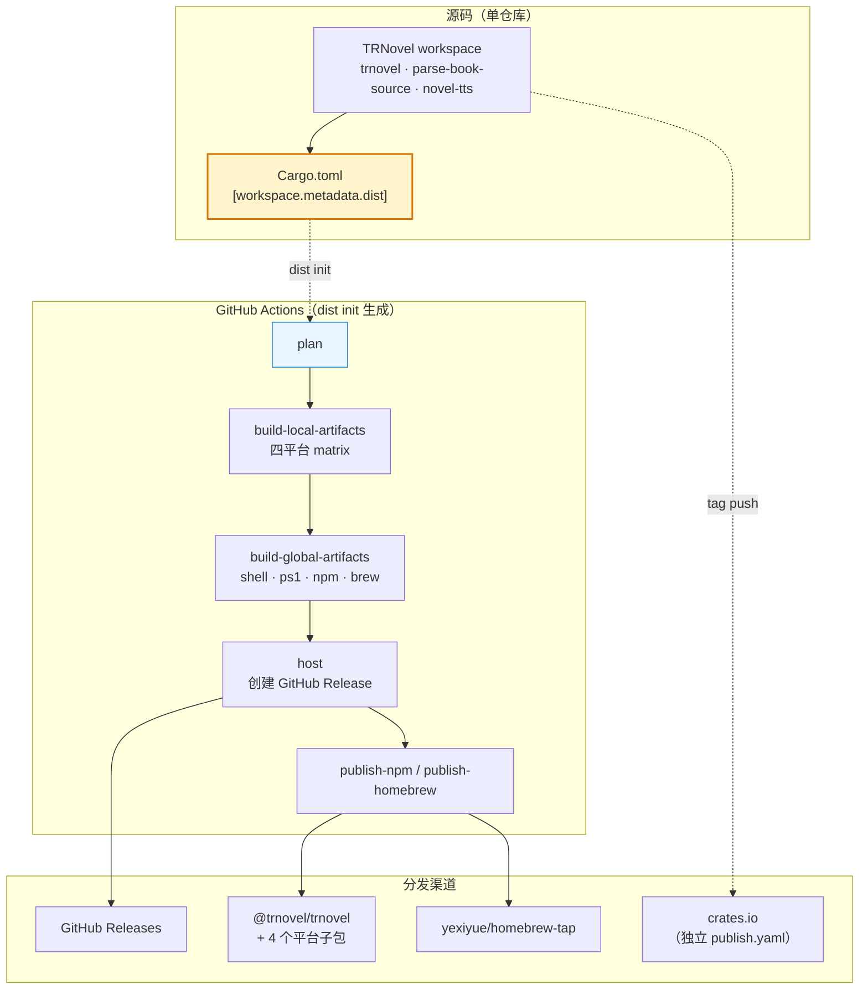
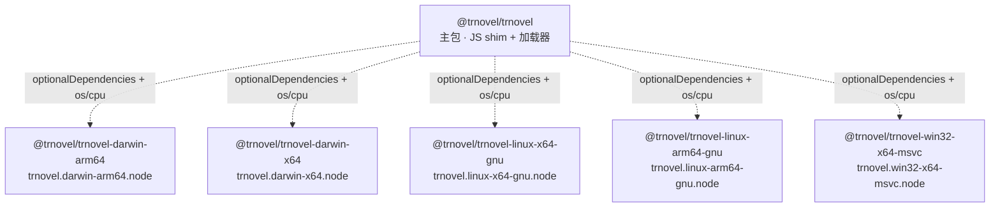
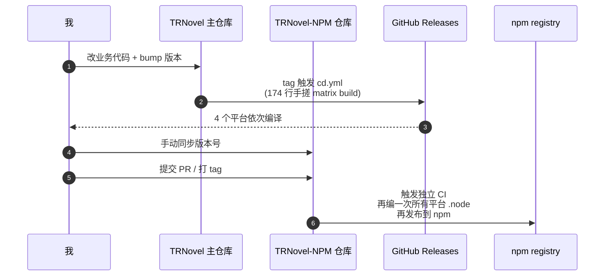
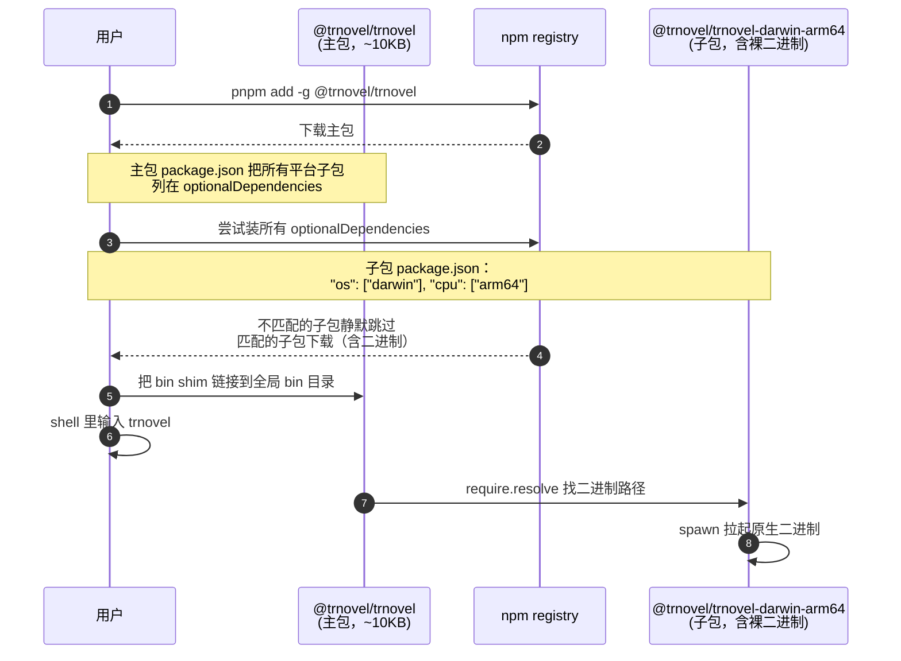
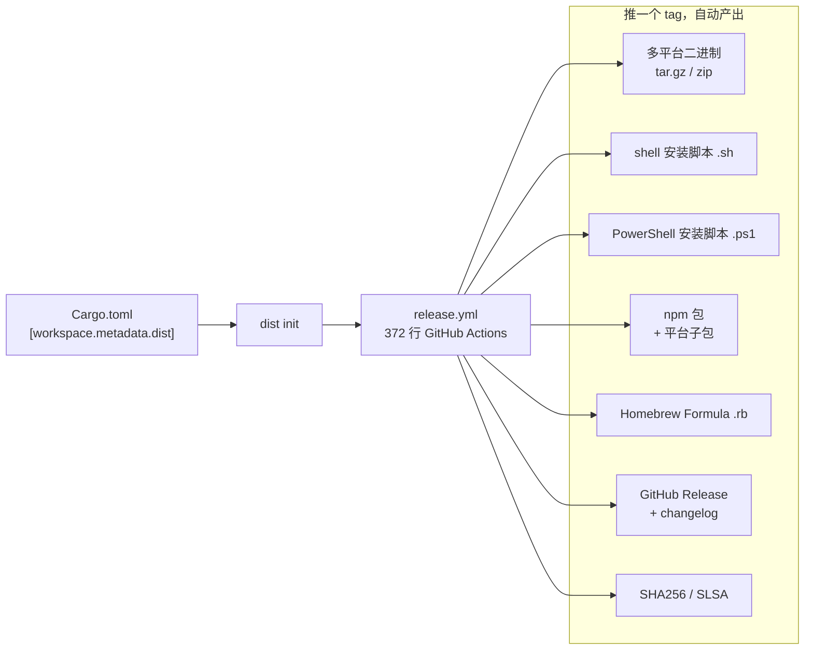

# 用 cargo-dist 接管 Rust CLI 的发布：以 TRNovel 为例

> 一篇关于"如何把一个 Rust 命令行工具发到 npm、Homebrew 和 shell 一键脚本"的工程笔记。
> 主角是 TRNovel：一个用 Rust + Ratatui 写的终端小说阅读器。最初通过 NAPI-RS + 独立仓库分发 npm，后来迁移到 cargo-dist，所有渠道在一份 Cargo.toml 里集中管理。

## 先说结论

TRNovel 之前的发布链路是这样的：

1. 主仓库手写 174 行 cd.yml，做四平台二进制的 matrix 构建；
2. 用 NAPI-RS 把 Rust 编成 `.node` 原生扩展，给 npm 用；
3. 拆出独立仓库 [TRNovel-NPM](https://github.com/yexiyue/TRNovel-NPM)，里面再编一遍二进制，再发一次 npm；
4. Homebrew 没顾上，用户只能 `cargo install` 或下 GitHub Release 的 zip。

现在的发布链路是这样的：

1. 在 Cargo.toml 里写一段 `[workspace.metadata.dist]`；
2. `dist init` 生成 `trnovel-release.yml`；
3. 推一个 `trnovel-v*` tag，自动产出多平台二进制、shell / PowerShell 安装脚本、npm 包、Homebrew Formula，并发布 GitHub Release。

源码一行没改。原来手搓的 174 行 cd.yml 和独立仓库 256 行 CI 全部归档。

## 目录

- [整体架构](#整体架构)
- [TRNovel 是什么](#trnovel-是什么)
- [为什么之前用 napi-rs 是错位选型](#为什么之前用-napi-rs-是错位选型)
- [npm 凭什么能直接装二进制](#npm-凭什么能直接装二进制)
- [cargo-dist 在做的事](#cargo-dist-在做的事)
- [一份完整的配置](#一份完整的配置)
- [迁移过程中绕不开的四个坑](#迁移过程中绕不开的四个坑)
- [给用户的安装方式](#给用户的安装方式)
- [这套方案的工程收益](#这套方案的工程收益)
- [代价和坑](#代价和坑)
- [如果你也想用 cargo-dist](#如果你也想用-cargo-dist)
- [TRNovel 现在是什么状态](#trnovel-现在是什么状态)

## 整体架构



下面按这个图自上而下展开。

## TRNovel 是什么

TRNovel（Terminal Reader for Novel）是一个在终端里看小说的 Rust CLI：

- 阅读本地 `.txt` 文件，自动识别章节和阅读进度；
- 通过自定义书源访问网络小说，与 [Legado](https://github.com/gedoor/legado) 书源部分兼容；
- 集成 Kokoro TTS 模型，支持边读边听；
- 支持自定义终端主题、隐藏/显示标题；
- 跨 Windows / macOS / Linux。

底层是 Rust + [ratatui-kit](https://github.com/yexiyue/ratatui-kit)，目前同时发布到 crates.io、npm、Homebrew，以及 shell / PowerShell 一键安装脚本。

这套分发能力一个月前还需要两个仓库 + 一套 NAPI-RS 工程才能凑齐。

## 为什么之前用 napi-rs 是错位选型

事情的起点是 2024 年 12 月。当时我想让前端同学也能用 `pnpm add -g @trnovel/trnovel` 装上 TRNovel。

npm 不能像 cargo 那样在用户机器上现场编译，得在每个平台预编译好产物再上传。当时看到 SWC、Parcel、Rspack 这些"JS 工具链里的 Rust"全在用 NAPI-RS，就顺手选了它。

这是整件事第一个、也是真正的错位选型。

NAPI-RS 的设计目标是 **让 JavaScript 同步调用 Rust 函数**：把 Rust 代码编成 Node.js 原生扩展（`.node` 文件），通过 N-API 暴露成 JS 函数。它的真正主场是这几类项目：

| 场景 | 典型例子 |
|---|---|
| JS 工具链里嵌一段 Rust 加速逻辑 | SWC、Parcel、Rspack、Lightning CSS |
| 需要在 JS 进程中同步拿到结果 | `transformSync(code)` 这种 API |
| Node 库本身就是核心运行时 | 没有"独立可执行"的概念 |

TRNovel 完全不符合这些条件。它是一个独立的 CLI，`cargo build` 直接产出可执行文件，不需要给任何 JS 暴露 API。但为了把它发到 npm，`packages/Cargo.toml` 当时是这样写的：

```toml
[lib]
crate-type = ["cdylib"]      # 编成动态库，不是 binary

[dependencies]
napi = { version = "2.12.2", features = ["napi4"] }
napi-derive = "2.12.2"
trnovel = "0.3.1"            # 把主 crate 当依赖塞进来

[build-dependencies]
napi-build = "2.0.1"
```

入口 `packages/bin/trnovel.js` 也不是直接拉起 release 二进制，而是 `require` 那个 `.node`：

```js
#!/usr/bin/env node
const { run } = require("./packages/trnovel/index");
run([path.parse(script).name, ...process.argv.slice(2)])
  .then(() => process.exit(0))
  .catch((e) => { console.error(e); process.exit(1); });
```

整个 npm 包的拓扑是这样：



第一次提交带进来了 23 个文件 / 760 行配置。为了让主仓库目录干净，又拆出独立仓库 TRNovel-NPM：

```text
feat: 另起仓库发布 npm
  删除 3705 行，新增 1 行
```

拆完之后每发一个版本要做这些事：



实际每发一个版本要踩过的点：

| 痛点 | 表现 |
|---|---|
| 版本号同步 | 两个仓库的版本号靠手动对齐 |
| 重复编译 | TRNovel-NPM 自己又是一份完整 Rust 构建，所有平台都得再编一次 |
| Linux 依赖 | `libasound2-dev`、`libssl-dev`、`cross`、`zigbuild` 这些每套 CI 各配一遍 |
| Windows 链接 | `ort` ONNX Runtime 是动态 CRT 编译，静态链接会 LNK2001，两套 CI 都要调 |
| Homebrew | 完全没顾上，要再写一份 tap 仓库的 CI |

git log 里那段时间有一排 `test: npm ci` 的失败提交。但真正卡住我的不是"包放哪个仓库"，而是把一个独立 CLI 编成 `.node` 动态库之后多绕的那一大圈：Rust 代码不再独立运行，而是作为动态库被 Node 进程加载，stdio 还要手动桥接。双仓库、版本同步、两套 CI 这些痛苦都只是症状，根因是 napi-rs 不是这种项目的工具。

## npm 凭什么能直接装二进制

迁移之前我有一个自然的疑问：如果不走 napi-rs，npm 还能用来发 Rust CLI 吗？

可以。很多前端同学下意识觉得"npm 包只能装 JS 或 .node"，那是错觉。

> npm 不在乎你包里塞什么，它只是个 tarball 分发系统。

把整条链路拆开看。

**1. npm 包本质是一个 tarball**

`npm publish` 上传的是 `.tgz` 压缩包，registry 不解析、不校验、不限制内容类型。JS、`.node`、PNG、PDF，乃至一个 ELF / Mach-O / PE 可执行文件，都可以放进去。

**2. 让二进制能被命令行调用的，是 `package.json` 的 `bin` 字段**

```json
{
  "name": "@trnovel/trnovel",
  "bin": { "trnovel": "./run.js", "trn": "./run.js" }
}
```

`npm i -g` 跑完后，npm 在全局 bin 目录建一个 shim 软链指向 `./run.js`，并加进 PATH。

**3. `run.js` 用 `spawn` 拉起原生二进制**

cargo-dist 生成的 `run.js` 精简后大概是这样：

```js
#!/usr/bin/env node
const { spawn } = require('child_process');

const platform = process.platform;  // darwin | linux | win32
const arch = process.arch;          // arm64 | x64
const subpkg = `@trnovel/trnovel-${platform}-${arch}`;
const exe = require.resolve(`${subpkg}/trnovel${platform === 'win32' ? '.exe' : ''}`);

spawn(exe, process.argv.slice(2), { stdio: 'inherit' })
  .on('exit', code => process.exit(code));
```

**4. 二进制本体藏在平台子包里，靠 `optionalDependencies` + `os`/`cpu` 自动挑**



整个流程没有 postinstall 现下二进制——二进制本来就在 npm tarball 里，安装时就解压到 `node_modules/@trnovel/trnovel-darwin-arm64/trnovel`，直接可用。

跟 napi-rs 的核心区别只有一处：npm 子包里装的是什么。

| 维度 | napi-rs | cargo-dist |
|---|---|---|
| npm 子包装的是 | `.node` 动态库 | 裸可执行二进制 |
| 主包 shim 调用方式 | `require('.node')` | `spawn(binary)` |
| Rust 代码运行环境 | Node 进程内 | 独立子进程 |
| Rust 源码需不需要改 | 加 `#[napi]` 注解、`crate-type = "cdylib"` | 完全不改 |
| 适用场景 | JS 工具链里嵌 Rust 加速逻辑 | 独立 CLI / 应用 |

跨平台分发本身两边都是同一套机制：平台子包 + `optionalDependencies` + `os`/`cpu`。区别只在于子包里装什么。

## cargo-dist 在做的事

cargo-dist（命令叫 `dist`）的核心理念是：**把"如何发布"当成 Cargo 元数据，让工具生成 CI。**



这套设计有几个不那么显眼的好处：

- **CI 是生成出来的**。升级 cargo-dist 版本后重新 `dist init`，得到的就是新版最佳实践。不会出现"老 CI 跑了三年，没人敢动"的状态。
- **平台子包架构是它的副产物**。不用自己维护 `npm/<平台>/package.json`，`dist build` 阶段就把所有平台子包打包好。
- **shell 一键脚本天然带平台检测**。用户复制粘贴一条 curl，脚本自己 uname 选对应 tarball。
- **跟 cargo-release 协同**。`cargo release patch` 打 tag，cargo-dist 收到 tag 自动跑。

## 一份完整的配置

TRNovel 的全部相关配置都集中在 `Cargo.toml` 的 `[workspace.metadata.dist]` 段：

```toml
[workspace.metadata.dist]
cargo-dist-version = "0.32.0"
ci = "github"
installers = ["shell", "powershell", "npm", "homebrew"]
targets = [
    "aarch64-apple-darwin",
    "x86_64-apple-darwin",
    "x86_64-unknown-linux-gnu",
    "x86_64-pc-windows-msvc",
]
npm-scope = "@trnovel"
tap = "yexiyue/homebrew-tap"
publish-jobs = ["npm", "homebrew"]
tag-namespace = "trnovel"
install-path = "CARGO_HOME"
msvc-crt-static = false

[workspace.metadata.dist.dependencies.apt]
libasound2-dev = '*'
libssl-dev = '*'
pkg-config = '*'
```

加上 `[profile.dist]`（继承自 release）和一份 372 行自动生成的 `trnovel-release.yml`，就能跑通整套发布。

## 迁移过程中绕不开的四个坑

cargo-dist 总体顺利，但 TRNovel 这种"workspace + 有原生依赖"的项目还是踩了几个坑。

### tag-namespace：避免 workspace 子 crate 误触发

TRNovel 是一个 workspace，包含 `trnovel`、`parse-book-source`、`novel-tts` 三个 crate。每次 `cargo release` 会同时给三个 crate 打 tag：

```text
parse-book-source-v0.2.3
novel-tts-v0.1.6
trnovel-v0.9.0
```

如果 release.yml 的触发条件写成宽泛的 `*-v*`，三个 tag 都会触发，前两个会因为找不到 `trnovel` crate 直接报错。

解决方法是给 cargo-dist 配 `tag-namespace`：

```toml
tag-namespace = "trnovel"
```

生成的 yml 触发条件就变成：

```yaml
on:
  push:
    tags:
      - 'trnovel**[0-9]+.[0-9]+.[0-9]+*'
```

只有 `trnovel-v*` 才触发应用分发，库 crate 的 tag 只去 crates.io。

### msvc-crt-static = false：ONNX Runtime 的链接

TRNovel 用 Kokoro 模型做语音合成，依赖 [ort](https://github.com/pykeio/ort) 这个 ONNX Runtime 的 Rust 绑定。ort 的预编译动态库是按动态 CRT 编译的。

cargo-dist 在 Windows 上默认开 `+crt-static`，结果是：

```text
error LNK2001: unresolved external symbol __imp_tolower
error LNK2001: unresolved external symbol __imp__configthreadlocale
```

解决方法是关掉静态 CRT：

```toml
msvc-crt-static = false
```

任何依赖 prebuilt 动态库的 Rust 项目都可能遇到同样的问题。

### publish.yaml 不能和 cargo-dist 抢 GitHub Release

cargo-dist 会自动创建 GitHub Release 并上传 artifacts。如果项目里已经有一份 `softprops/action-gh-release` 在跑，就会出现两个 workflow 同时给同一个 tag 建 release，后到的那个会失败。

我的做法是保留 publish.yaml，但只让它发 crates.io：

```yaml
- name: Publish crate
  env:
    CARGO_REGISTRY_TOKEN: ${{ secrets.CARGO_REGISTRY_TOKEN }}
  run: cargo publish --token "$CARGO_REGISTRY_TOKEN"
```

GitHub Release、npm、Homebrew 全部交给 cargo-dist 生成的 `trnovel-release.yml`。

### install-path = CARGO_HOME：和 cargo install 对齐

```toml
install-path = "CARGO_HOME"
```

加这一行之后，`trnovel-installer.sh` 会把二进制装到 `~/.cargo/bin/trnovel`，和 `cargo install trnovel` 装出来的位置完全一致。已经在用 Rust 的人不需要再单独配 PATH。

## 给用户的安装方式

迁移之前用户能做的只有：

- `cargo install trnovel`（需要 Rust 工具链）
- `pnpm add -g @trnovel/trnovel`（需要 Node）
- 手动下载 GitHub Release 的 tar.gz / zip，自己加 PATH

迁移之后多了 shell / PowerShell 一键脚本和 Homebrew：

```bash
# macOS / Linux 一键脚本
curl --proto '=https' --tlsv1.2 -LsSf \
  https://github.com/yexiyue/TRNovel/releases/latest/download/trnovel-installer.sh | sh

# Homebrew
brew install yexiyue/tap/trnovel

# npm
pnpm add -g @trnovel/trnovel

# Cargo
cargo install trnovel
```

Windows：

```powershell
powershell -ExecutionPolicy Bypass -c "irm https://github.com/yexiyue/TRNovel/releases/latest/download/trnovel-installer.ps1 | iex"
```

所有链接都是 `/releases/latest/`，文档不需要随版本号更新。

## 这套方案的工程收益

**第一，源码不再被发布需求侵入。**
原来为了发 npm，主 crate 要有 `[lib]` 段、要 cdylib、要 napi 三件套；现在 Cargo.toml 回到一个普通 binary crate 的形态。

**第二，发版从"几个仓库各跑一次"变成"打一个 tag"。**
TRNovel-NPM 仓库可以归档了。

**第三，渠道扩展只是改一行 `installers`。**
未来想加 scoop / nix / deb，cargo-dist 支持后改一行配置即可。

**第四，CI 是生成的，不是手写的。**
升级 cargo-dist 版本，重新 `dist init`，得到的就是新版最佳实践。维护成本固定在元数据这一层。

## 代价和坑

这套方案也不是免费午餐。

| 坑 | 解决方式 |
|---|---|
| cargo-dist 还是 0.x 版本，配置 schema 偶有调整 | 升级时重新跑 `dist init`，把 metadata 段 diff 一下 |
| 默认 `+crt-static` 不适合有 prebuilt 动态库依赖的项目 | 显式 `msvc-crt-static = false` |
| workspace 多 crate 容易误触发 | 必须配 `tag-namespace` |
| 生成的 release.yml 不要手改 | 手改后下次 `dist init` 会被覆盖；要定制走 `[workspace.metadata.dist.github-custom-runners]` 等元数据扩展点 |
| GitHub Release / npm / homebrew 不能同时被多个 workflow 写 | 留下的 publish.yaml 仅做 crates.io |
| 仍然依赖 GitHub Actions runner | 离开 GitHub 需要 `ci = "gitlab"` 等其他 backend，目前生态以 GitHub 为主 |

## 如果你也想用 cargo-dist

可以按这个顺序判断和落地，而不是一上来就跑 `dist init`：

1. **判断它是否适合你。**
   项目是独立可执行（CLI、daemon、桌面 app）？需要发到多个渠道？想停止手写 matrix build？如果是，cargo-dist 几乎都更省事。
   如果项目本身是给 Node 调用的库（类似 SWC、Rspack），那 napi-rs 仍然更合适，cargo-dist 不在这条路上替代它。

2. **从最小配置开始。**
   先只开 `installers = ["shell", "powershell"]`，让 cargo-dist 把 shell 一键脚本跑通；再依次加 npm、homebrew。每加一个渠道，单独验证一次。

3. **先在 PR 模式下跑。**
   cargo-dist 生成的 release.yml 默认监听 PR，build 但不上传。改完配置先开一个 PR，把构建结果走通再合并到 main。

4. **workspace 项目第一时间配 `tag-namespace`。**
   否则库 crate 的 tag 会误触发整条发布流水线。

5. **保留一份最小的 publish.yaml 只发 crates.io。**
   cargo-dist 不接管 crates.io 发布，留一条独立流水线最干净。

6. **依赖原生库的项目检查 linkage 配置。**
   默认静态 CRT 在 Windows 上常碰到 prebuilt 动态库的链接问题，提前关掉省一轮 CI。

## TRNovel 现在是什么状态

TRNovel 是一个本地优先的终端小说阅读工具：

- 本地 `.txt` 阅读 + 章节自动识别 + 阅读进度记忆
- 网络书源（兼容部分 Legado 书源）
- Kokoro 模型驱动的 TTS 听书
- 自定义主题、隐藏 / 显示标题
- 不联网账号、不收集数据、不展示广告

支持的安装方式：

```bash
# macOS / Linux 一键脚本
curl --proto '=https' --tlsv1.2 -LsSf \
  https://github.com/yexiyue/TRNovel/releases/latest/download/trnovel-installer.sh | sh

# Homebrew
brew install yexiyue/tap/trnovel

# npm
pnpm add -g @trnovel/trnovel

# Cargo
cargo install trnovel
```

Windows：

```powershell
powershell -ExecutionPolicy Bypass -c "irm https://github.com/yexiyue/TRNovel/releases/latest/download/trnovel-installer.ps1 | iex"
```

相关仓库：

- [TRNovel](https://github.com/yexiyue/TRNovel)：主仓库
- [使用文档](https://yexiyue.github.io/TRNovel)
- [ratatui-kit](https://github.com/yexiyue/ratatui-kit)：底层 TUI 框架

## 参考资料

- [cargo-dist](https://github.com/axodotdev/cargo-dist)
- [cargo-dist Book](https://opensource.axo.dev/cargo-dist/)
- [NAPI-RS](https://napi.rs)
- [Cargo workspace.metadata](https://doc.rust-lang.org/cargo/reference/workspaces.html#the-workspacemetadata-table)
- [cargo-release](https://github.com/crate-ci/cargo-release)
- [ort (ONNX Runtime Rust)](https://github.com/pykeio/ort)
