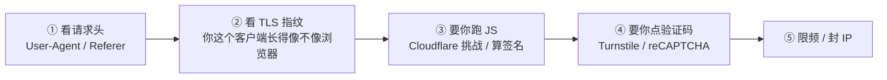
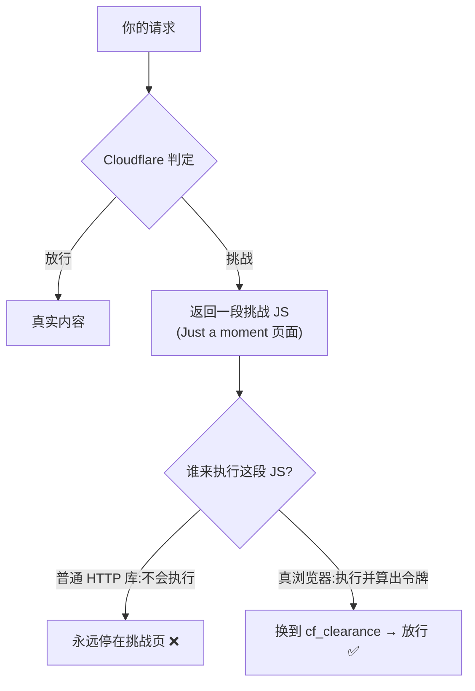
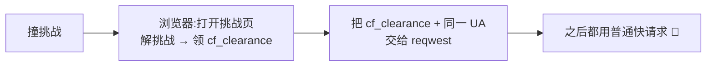
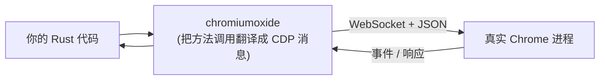
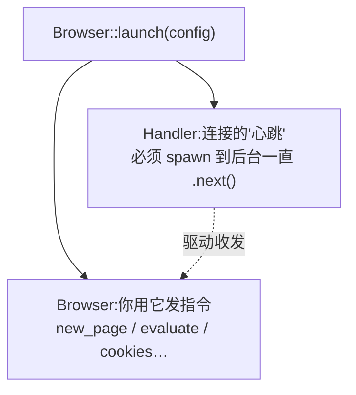
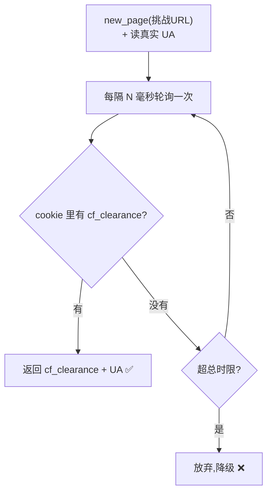
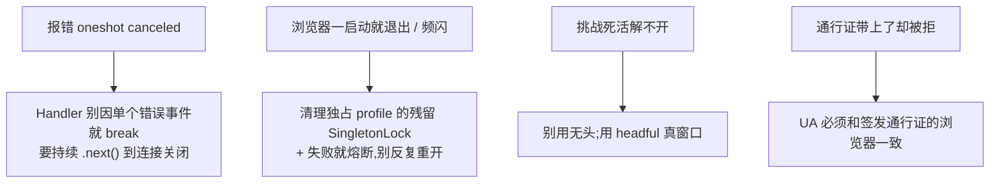

# 从零理解反爬,以及怎么用 chromiumoxide 拿一台真浏览器去过关

这篇是写给「这块完全没接触过」的人的。我们会从「爬虫为什么会撞墙」讲起,把反爬的套路一层层摊开,再讲清楚 `chromiumoxide` 这个 Rust 库到底是干嘛的、怎么用它驱动一个真浏览器去解 Cloudflare 的人机验证。

不需要你懂浏览器内核,也不需要你写过爬虫。我们慢慢来。

---

## 一、先讲个场景:你的爬虫撞墙了

假设你想抓某个网站的内容,最朴素的写法是发一个 HTTP 请求:

```rust
let html = reqwest::get("https://example.com/search?q=蛊真人").await?.text().await?;
```

大多数时候这就够了。但有一天你会遇到这样的情况:**返回的不是你要的内容,而是一张写着「请稍候… / Just a moment…」的页面**,还带个 403 状态码。

这就是「反爬」。网站发现你「不太像一个真人用浏览器在访问」,于是拦下了你。

要破局,你得先搞懂:**网站到底是怎么判断「你不像真人」的?**

---

## 二、反爬到底在拦什么:一条从浅到深的光谱

反爬不是一个开关,而是一整条光谱,从「随手就能绕」到「几乎得搬出真浏览器」:



逐层翻译成人话:

- **① 请求头**:最浅。网站看你的 `User-Agent`(自报家门「我是谁」)、`Referer`(从哪个页面跳来的)。一个不带 UA 的请求一眼假。**对策:把头补全**,reqwest 直接能做。
- **② TLS 指纹**:稍深。你和网站建立加密连接(HTTPS)时,握手的细节(支持哪些加密套件、扩展的顺序等)会形成一个「指纹」。浏览器的指纹 和 Python/Rust 默认 HTTP 库的指纹 不一样。网站能据此分辨。**对策:用能伪装浏览器指纹的客户端**(Rust 里有 `wreq` 等)。
- **③ 跑 JS**:质变。网站返回一段 JavaScript,要求你的「浏览器」执行它、算出一个答案,才放行。**普通 HTTP 库不会执行 JS,所以这一关过不了**——这正是 Cloudflare 的「Managed Challenge」。
- **④ 验证码 / 勾选框**:更深。让你点「我是真人」(Cloudflare Turnstile)或选图。这通常需要**真人**或专门的打码服务。
- **⑤ 限频 / 封 IP**:维度不同。访问太频繁就限速或封禁。**对策:限速、换 IP/代理**。

理解这条光谱,你就能对症下药——而不是一上来就「祭出无头浏览器」这种重武器。

---

## 三、关键认知:普通 HTTP 客户端为什么过不了「JS 挑战」

这是最容易卡住小白的地方,务必讲透。

`reqwest`、Python 的 `requests` 这类库,本质是「**发请求、收字节**」。它们:

- 会建立连接、发 HTTP 报文、把响应原样拿回来;
- **但不会去执行响应里的 JavaScript**,因为它们不是浏览器,没有 JS 引擎、没有 DOM。

而 Cloudflare 的 Managed Challenge 返回的那张「Just a moment」页面,核心是一段 JS:它会做一堆计算/网络往返,算出一个令牌,然后浏览器拿这个令牌换到一张**通行证 cookie**(叫 `cf_clearance`),之后才跳到真正的内容页。



所以结论很硬:**要过 JS 挑战,你必须有一个能真正执行 JavaScript 的东西——也就是一个真浏览器。** 这就引出了 `chromiumoxide`。

> 几个你会反复看到的名词,先记住:
> - **cf_clearance**:过关后 Cloudflare 发给你的「通行证」cookie,带着它后续请求就放行。它通常**和你的 User-Agent、IP 绑定**。
> - **__cf_bm**:Cloudflare 的「机器人管理」cookie,访问时就会下发,和 cf_clearance 不是一回事。
> - **cf-mitigated: challenge**:响应头里出现这个,几乎可以确定你撞上了挑战。

---

## 四、思路:用真浏览器当一台「通行证烤箱」

「用真浏览器」不代表「以后每个请求都走浏览器」——那太慢了。聪明的做法是:

> **只用浏览器解一次挑战、领一张 `cf_clearance` 通行证,然后把通行证交给快速的普通 HTTP 客户端去干后续所有活。**

像一台烤箱:进去烤一张通行证,出来该用普通请求还用普通请求。



两个**实战经验**(很多教程不会告诉你):

1. **得用「有界面」的浏览器(headful),不能用无头(headless)。** Cloudflare 能识别无头浏览器并拒绝放行,真实可见的窗口成功率高得多。
2. **通行证绑 User-Agent。** 浏览器解完挑战,你必须把**浏览器的真实 UA** 一起记下来,后续 reqwest 请求要用同一个 UA,否则通行证会被拒。

---

## 五、CDP 是什么:你和浏览器之间的「遥控协议」

要让代码去「驱动」一个浏览器(打开页面、读 cookie、跑 JS),靠的是 **CDP(Chrome DevTools Protocol,Chrome 开发者工具协议)**。

你平时按 F12 打开的开发者工具,其实就是通过 CDP 在和浏览器对话。Chrome 启动时加一个参数 `--remote-debugging-port`,就会开一个 **WebSocket** 端口,任何程序都能连上去,用 JSON 消息发指令:「打开这个网址」「执行这段 JS」「把 cookie 给我」。



著名的 Puppeteer(Node)、Playwright,以及 Rust 的 `chromiumoxide`,**本质都是 CDP 的客户端**——把「打开页面」这种友好的 API,翻译成底层的 CDP 消息发给浏览器。所以你学的是同一套心智模型,只是语言不同。

---

## 六、chromiumoxide 上手:Browser 和 Handler 两件套

`chromiumoxide` 是 Rust 的异步 CDP 客户端。先加依赖:

```toml
[dependencies]
chromiumoxide = { version = "0.7", default-features = false, features = ["tokio-runtime"] }
futures = "0.3"      # 需要 StreamExt 来驱动事件流
tokio = { version = "1", features = ["full"] }
```

最容易让新手困惑的是它的「两件套」模型:`Browser::launch` 一次性返回**两样东西**——`Browser`(你用来下指令)和 `Handler`(连接的事件循环)。**你必须把 Handler 放到一个后台任务里持续驱动,否则一切都不会动。**



为什么要分成两个?因为 CDP 是**异步双向**的:你发指令要等响应,浏览器也会主动推事件。Handler 就是那个不停地收发消息、把响应分发回各个等待点的「邮差」。你不让邮差跑起来,你发出去的指令就永远收不到回信。

骨架代码:

```rust
use chromiumoxide::{Browser, BrowserConfig};
use futures::StreamExt;

let config = BrowserConfig::builder()
    .chrome_executable("/Applications/Google Chrome.app/Contents/MacOS/Google Chrome")
    .user_data_dir("/Users/me/.novel/browser-profile") // 用独立 profile,养号 + 存 cookie
    .with_head()                       // 关键:有界面(headful),不要无头
    .arg("--no-first-run")
    .build()
    .map_err(|e| anyhow::anyhow!(e))?; // build() 失败返回的是 String

let (mut browser, mut handler) = Browser::launch(config).await?;

// 把"邮差"放到后台一直跑,直到连接关闭
let handler_task = tokio::spawn(async move {
    while handler.next().await.is_some() {}
});
```

> `chrome_executable` 要填你机器上真实的 Chrome 路径;`user_data_dir` 指定一个**独立的用户数据目录**——好处是这个「分身浏览器」有自己的 cookie/历史,不干扰你日常用的 Chrome,而且过过一次挑战后通行证能留着复用。

---

## 七、四个核心操作

有了 `browser`,常用的就这几招:

```rust
use chromiumoxide::cdp::browser_protocol::page::BringToFrontParams;

// 1) 打开一个页面
let page = browser.new_page("https://example.com/search?q=蛊真人").await?;

// 2) 在页面里执行 JS,拿返回值(这里拿真实 User-Agent)
let ua: String = page.evaluate("navigator.userAgent").await?.into_value()?;

// 3) 读 cookie(明文!绕过磁盘上的加密),找 cf_clearance
let cookies = page.get_cookies().await?;          // Vec<Cookie>,有 .name / .value / .domain
let clearance = cookies.iter().find(|c| c.name == "cf_clearance");

// 4) 把窗口提到最前(需要用户点验证码时很有用)——用原始 CDP 命令
page.execute(BringToFrontParams::default()).await?;

// 用完关掉
browser.close().await?;
handler_task.abort();
```

几个点:

- **`evaluate`** 就是「在页面里跑一段 JS 并取回结果」,`into_value::<T>()` 把 JS 返回值反序列化成 Rust 类型。
- **`get_cookies`** 直接拿到**明文** cookie——这比去读 Chrome 磁盘上那个加密的 Cookies 数据库省事太多(磁盘上的值在 macOS 上是 Keychain 加密的)。
- **`execute(...)`** 是「逃生口」:chromiumoxide 没封装的 CDP 命令,可以用 `page.execute(原始命令参数)` 直接发。

---

## 八、一个完整最小例子:cookie 烤箱

把前面拼起来,就是一个「打开挑战页 → 轮询直到拿到 cf_clearance → 返回通行证 + UA」的最小实现:



```rust
use std::time::{Duration, Instant};

let page = browser.new_page(challenge_url).await?;
let ua: String = page.evaluate("navigator.userAgent").await?.into_value().unwrap_or_default();

let start = Instant::now();
loop {
    if let Ok(cookies) = page.get_cookies().await
        && let Some(c) = cookies.iter().find(|c| c.name == "cf_clearance")
    {
        return Ok((c.value.clone(), ua));      // 拿到通行证 + UA
    }
    if start.elapsed() > Duration::from_secs(60) {
        return Err("解挑战超时");
    }
    tokio::time::sleep(Duration::from_millis(800)).await;
}
```

非交互的挑战,浏览器自己几秒就解开,这个循环就拿到 `cf_clearance` 了。之后你把它塞进 reqwest 的请求头(`Cookie: cf_clearance=...` + 同一个 `User-Agent`),就能用快请求拿真实内容。

---

## 九、我们真踩过的坑(小白最该先知道的几条)

理论好讲,真接进项目才知道哪里疼。下面每一条都是实打实换来的:



- **`oneshot canceled`**:你发了个 CDP 命令在等回信,结果那个「邮差」Handler 提前退出了——回信通道被丢弃就报这个。常见原因是 Handler 循环写成「遇到任何一个错误事件就 `break`」。正确写法是**一直 `.next()` 到流结束**(连接真正关闭)。
- **浏览器瞬退 / 频闪**:用了持久 `user_data_dir` 时,上次异常退出会在该目录留下 `SingletonLock`,新实例一看「profile 被占用」就立刻退出;如果你的程序又在出错后反复重试,就会**反复开浏览器**(屏幕一闪一闪)。两手抓:启动前**清掉残留的 SingletonLock**(这个 profile 你独占,清理安全);以及**失败就熔断**,本次会话别再反复重开。
- **无头解不开**:`headless` 浏览器会被 Cloudflare 识别。用 `.with_head()` 开真窗口。
- **UA 不一致被拒**:`cf_clearance` 绑 UA。解挑战时记下浏览器真实 UA,后续请求用同一个。

---

## 十、小结

把这篇浓缩一下:

1. **反爬是一条光谱**——先判断对方拦在哪一层,再决定用多重的武器;
2. **JS 挑战这一层,普通 HTTP 库必败**,因为它不执行 JavaScript;
3. **真浏览器是过 JS 挑战的钥匙**,而 CDP 是遥控浏览器的协议,`chromiumoxide` 是 Rust 的 CDP 客户端;
4. **chromiumoxide 的心智模型 = Browser(下指令)+ Handler(后台跑的邮差)**;核心操作就 `new_page / evaluate / get_cookies / execute` 几招;
5. **别每个请求都走浏览器**——用它当通行证烤箱,领到 `cf_clearance` 后交给快请求;
6. 真正的难点在工程细节:headful、UA 绑定、Handler 别提前退、清残留锁、失败熔断。

如果你想看这套东西在一个真实项目里是怎么和「书源引擎」拼起来、怎么做优雅降级和并发协调的,可以接着读同目录下的《书源引擎的设计原理》。
