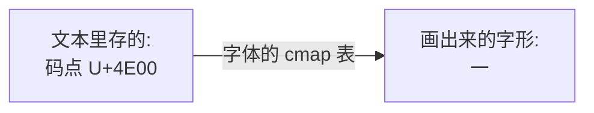
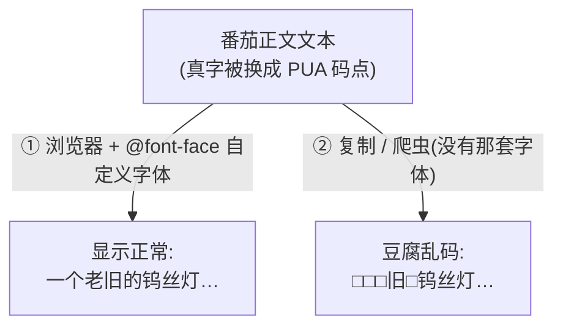
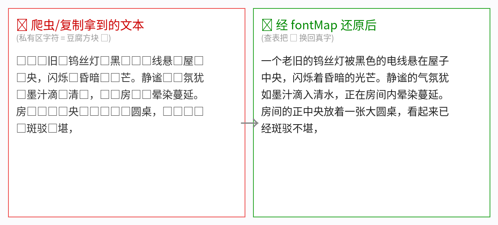
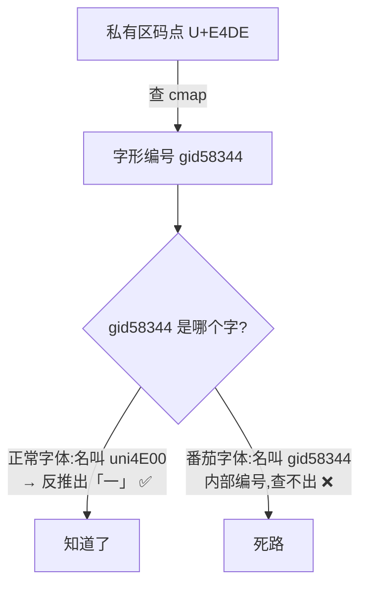
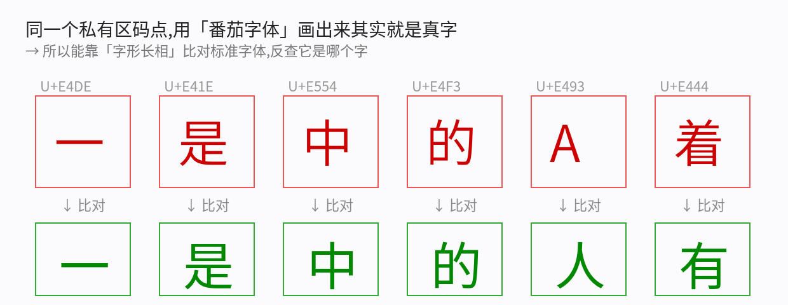
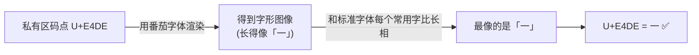
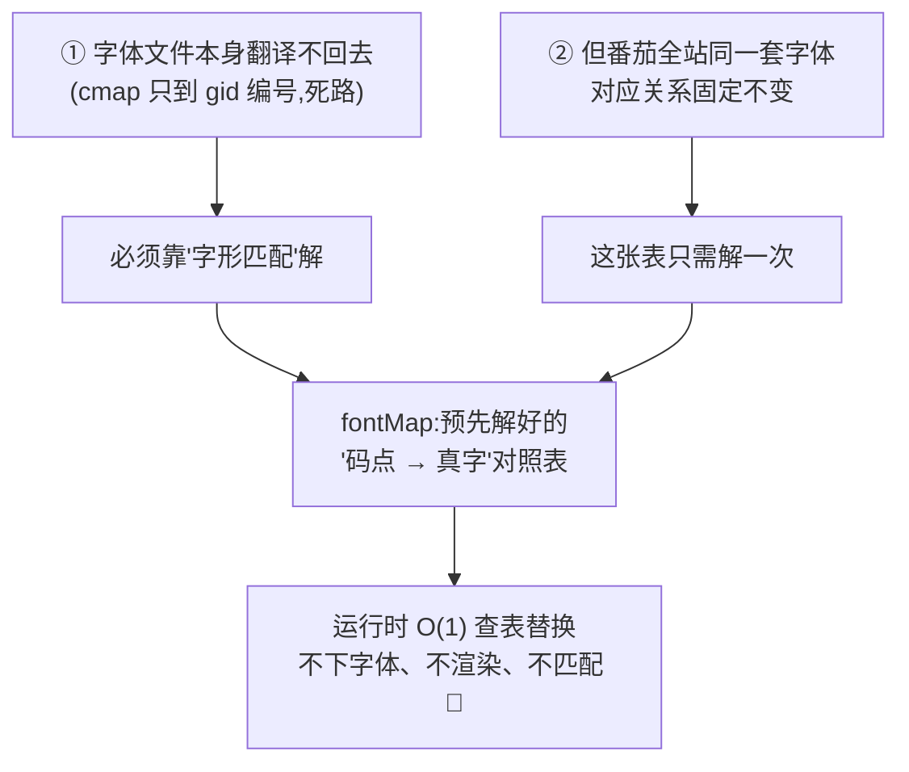
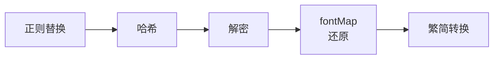
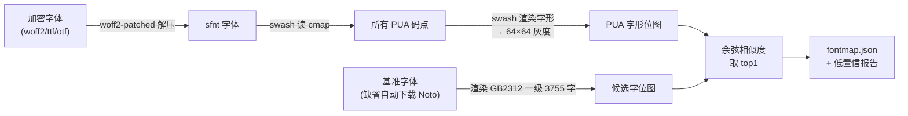
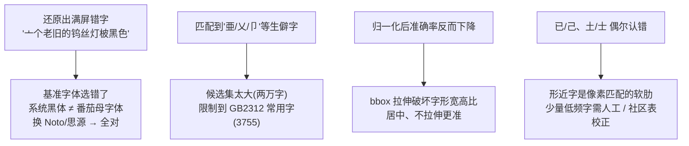

# 从零理解「字体反爬」,以及我们为什么要做一张 fontMap 对照表

这篇写给完全没接触过「字体反爬」的人。我们从「明明能看见、却复制不出来的字」这个怪现象讲起,一层层拆开番茄小说的障眼法,最后讲清楚我们为什么要在书源引擎里加一张叫 `fontMap` 的对照表。

不需要你懂字体格式,也不需要你写过爬虫。慢慢来。

---

## 一、一个怪现象:看得见,却复制不出来

打开番茄小说网页版,正文显示得好好的:

> 一个老旧的钨丝灯被黑色的电线悬在屋子中央……

但你把这段**复制**到记事本,或者用爬虫抓下来,得到的却是夹着一堆方块的乱码:

```
□□□旧□钨丝灯□黑□□□线悬□屋□□央，闪烁□昏暗□□芒。
```

(那些 □ 在你的环境里可能显示成空白、问号或方框。)

奇怪吧?**同一段文字,在番茄页面上是「一个老旧的钨丝灯」,换个地方就成了豆腐块。** 这就是「字体反爬」。要搞懂它,得先回到最底层:电脑里的「字」到底是怎么变成你眼睛看到的「形」的。

---

## 二、从零:码点 和 字形 是两回事

你在屏幕上看到一个「一」字,背后其实是两样东西在配合:

1. **码点(code point)**:文本里存的不是「字的样子」,而是一个数字编号。比如「一」的 Unicode 码点是 `U+4E00`。文本只认编号。
2. **字形(glyph)**:把编号画成具体长什么样,是**字体**的活。字体里有一张对照表(叫 `cmap`),记录「码点 → 该画哪个字形」。



换句话说:**文本只存编号,长相由字体决定。** 同一个编号,换一套字体,可以画成不一样的形状。记住这句话——番茄整个把戏都建立在它之上。

---

## 三、Unicode 的「官方留白」:私有区 PUA

Unicode 给几乎所有文字都规定了码点和标准长相。但它特意留了一段「空白区」不做规定:

> **私有使用区(Private Use Area, PUA)**:`U+E000`–`U+F8FF` 这一段,Unicode 说「这里我不管,谁爱画啥画啥」。

这段区间没有标准字形。所以——**如果你的电脑里没有专门为这些码点设计字形的字体,系统根本不知道该画什么,只能显示一个豆腐块 □。**

这正是番茄要利用的「灰色地带」。

---

## 四、番茄的障眼法:偷换码点 + 自带字体

番茄做了两件事:

1. **把正文里的真字,换成私有区码点。** 比如把「一」换成 `U+E4DE`、「的」换成 `U+E4F3`。于是正文文本变成一串私有区编号。
2. **配一套自定义字体,把真字的字形画在这些私有区码点上。** 在这套字体里,`U+E4DE` 对应的字形画出来就是「一」。网页用 CSS 的 `@font-face` 把这套字体加载进来。

于是:

- **在番茄网页里**:浏览器加载了那套自定义字体,`U+E4DE` 被画成「一」,你看着一切正常。
- **复制出去 / 爬虫抓取**:你拿到的是文本里的**码点** `U+E4DE`,而你的记事本、你的爬虫没有那套字体,这个私有区码点就成了豆腐 □。



一句话:**它没加密内容,而是「偷换了文字的编号」,再用一套只有它自己页面才加载的字体把编号还原成字。** 你能看,是因为你借了它的字体;你抓不走,是因为字体没跟着走。

下面是真实效果——左边是抓到的(私有区 = 豆腐),右边是还原后:



---

## 五、那把字体下载下来,不就能翻译回去了?

直觉很合理:**既然字体里有「码点 → 字形」的 cmap 表,我把番茄字体下载下来,查一下 `U+E4DE` 对应哪个字不就行了?**

可惜没这么简单。我们真去解析了番茄的字体,它的 cmap 长这样:

```
U+E4DE  →  gid58344
U+E4F3  →  gid58761
U+E41E  →  gid58402
...
```

问题出在右边:`gid58344`。

- **正常字体**里,字形通常带个「有意义的名字」,比如「一」的字形叫 `uni4E00`——看名字就能反推出它是 `U+4E00`(一)。
- **番茄的字体**里,字形名字是 `gid58344` 这种**纯内部编号**(它是从一个几万字的母字库里抽出来的第 58344 号字形)。这个编号**不告诉你它是哪个字**。



所以光读字体文件,翻译不回去。cmap 只能把你带到「字形编号」,然后就断了。

---

## 六、破局:不看名字,看「长相」

字形虽然没有名字,但它有**形状**。`U+E4DE` 在番茄字体里画出来,长得就是「一」——番茄不可能改变字形本身的样子,否则你在网页上也看不懂了。

于是思路来了:**把每个私有区码点的字形渲染出来,拿它的「长相」去和标准字体里的每个常用字比对,最像的那个,就是答案。**





这其实就是一种小型的「OCR / 字形识别」。我们用思源 / Noto 字体当「标准答案库」,逐字比对,就能把私有区码点一个个还原回真字。

---

## 七、关键发现:番茄全站,就一套字体

字形匹配能解,但它慢(要渲染、要逐字比对)、还得带一个基准字体。如果番茄**每本书、每章都换一套字体**,那就得每次都重新解一遍,很麻烦。

但我们抓了 **4 本完全不同的书**,把它们的字体文件拿来一比:

| 书 | 字体文件名 | 内容 MD5 |
|---|---|---|
| 书 A | `dc027189e0ba4cd.woff2` | `d15c2b29` |
| 书 B | `dc027189e0ba4cd.woff2` | `d15c2b29` |
| 书 C | `dc027189e0ba4cd.woff2` | `d15c2b29` |
| 书 D | `dc027189e0ba4cd.woff2` | `d15c2b29` |

**完全一样。** 番茄全站共用同一套加密字体。

这意味着:`U+E4DE = 一` 这个对应关系是**全站固定、长期不变**的(直到番茄哪天换字体)。那字形匹配就只需要**做一次**——把 362 个私有区码点全部解出来,存成一张对照表:

```
U+E4DE → 一
U+E4F3 → 的
U+E41E → 是
U+E554 → 中
U+E493 → 人
... (共 362 个)
```

**这张表,就是 fontMap。**

---

## 八、所以,为什么需要 fontMap?

把前面两点合起来,就是答案:



- 如果**没有 fontMap**:每次读正文,都要下载字体、渲染每个字形、和几千个候选字比对——又慢又重。
- **有了 fontMap**:看到 `U+E4DE`,直接查表换成「一」。一次查表,搞定。

和同目录那篇讲 Cloudflare 的博客里「通行证烤箱」是一样的哲学:**把昂贵的解算做一次,把结果缓存成一张便宜的表反复用。**

---

## 九、在 TRNovel 里怎么落地:一个通用的清洗步骤

我们没有把它写成「番茄专用」代码,而是做成书源引擎里一个**通用的清洗步骤** `fontMap`,和「解密」「繁简转换」这些步骤平级。因为**字体反爬是全行业通用招数**——起点、晋江、知乎、猫眼、大众点评都用过。任何「私有区固定映射」的站点,配一张自己的表就能复用。

书源配置里这样写——`fontMap` 直接就是一张「码点 → 真字」表,**内联在书源里**。这是有意的设计:通用引擎不该内置任何特定站点的数据,引擎只提供「按表替换」这个纯机制,表是数据、跟着书源走。

```json
{
  "content": {
    "value": {
      "via": "raw",
      "clean": [
        { "fontMap": { "E4DE": "一", "E4F3": "的", "E41E": "是" } }
      ]
    }
  }
}
```

番茄那张 362 字的表当然不用手写——交给下一节的 `trn gen-fontmap` 命令自动生成。

Rust 端的核心就是查表替换,极简:

```rust
/// 字体反爬还原:把文本里的私有区字符按映射表换回真字(表外字符原样保留)。
fn remap(s: &str, map: &HashMap<char, char>) -> String {
    s.chars().map(|c| map.get(&c).copied().unwrap_or(c)).collect()
}
```

它被插在清洗流水线里(解密之后、繁简转换之前):



还原效果:

```
输入: □□□旧□钨丝灯□黑□□□线悬□屋□□央…
输出: 一个老旧的钨丝灯被黑色的电线悬在屋子中央…
```

---

## 十、那张表怎么来的:`trn gen-fontmap` 的实现

表是数据,总得有个工具生成它。我们把它做成 `trn` 的一个子命令——纯 Rust、零 C 依赖,把前面讲的字形匹配落地:

```
trn gen-fontmap <加密字体 URL 或本地路径> -o fontmap.json [-b 基准字体]
```

产出的 JSON 直接粘进书源的 `fontMap`。整条流水线:



**纯 Rust 字形渲染栈**(刻意避开 FreeType 这类 C 依赖):

| 环节 | crate | 干什么 |
|---|---|---|
| woff2 → sfnt | `woff2-patched` | 把 woff2 解压回普通 ttf/otf |
| 取字形轮廓(含 CFF) | `swash`(内含 `skrifa`) | 思源/Noto 是 CFF 轮廓,很多渲染库不支持 |
| 轮廓 → 位图 | `swash`(内含 `zeno`) | 把字形光栅化成灰度图做比对 |

核心就两步——渲染成归一化灰度向量,再求余弦相似度:

```rust
// 渲染一个字形到 64×64 居中灰度网格,并 L2 归一化
fn render_norm(scaler: &mut Scaler<'_>, gid: u16) -> Option<Vec<f32>> {
    let img = Render::new(&[Source::Outline])
        .format(Format::Alpha)
        .render(scaler, gid)?;
    // …按 placement 把 img.data 居中铺到 64×64,再除以 L2 范数…
}

// 归一化向量点积 = 余弦相似度;每个 PUA 取最像的候选字
let (best, score) = cand_vecs.iter()
    .map(|(c, cv)| (*c, dot(&v, cv)))
    .max_by(|a, b| a.1.total_cmp(&b.1))?;
```

命令跑完还会把相似度低于阈值的字单独列出来——那些就是最可能认错、值得人工瞄一眼的形近字。

**依赖上也踩了两个坑**:① reqwest 0.13 默认把 TLS 后端换成 `aws-lc-rs`(要 cmake + C/C++ 编译),撞上项目「零 C 依赖、跨平台分发」的底线,于是钉回 0.12 的 `ring`;② `woff2` 0.3 这个 crate 自己都编译不过(它依赖的 `safer-bytes` API 漂移了),换成修复 fork `woff2-patched` 才通。**哪怕是低频开发工具,也得守住零 C 依赖这条线。**

---

## 十一、我们真踩过的坑

生成那张对照表的过程,远比「跑个字形匹配」曲折。每条都是实打实换来的:



- **基准字体要选对。** 一开始用 macOS 自带黑体(STHeiti)当标准答案库,还原出来是「亠个老旧的钨丝灯柀黑色的丰线悬并屋了中央」——满屏形近错字。换成 **Noto / 思源**(番茄母字体很可能同源)后,直接变成「一个老旧的钨丝灯被黑色的电线悬在屋子中央」,全对。**标准答案库越接近原字体,匹配越准。**
- **候选字别用全集。** 最初拿整个 CJK(两万字)当候选,结果形近时匹配到「亜」「乂」「卩」这种没人用的生僻字。把候选限制到 **GB2312 一级常用字(3755 个)**——小说正文几乎全在里头——错配立刻消失。
- **别画蛇添足做归一化。** 想着把字形裁剪、缩放到统一方格再比,结果把瘦字胖字硬拉成方形,反而更不准。**居中、不拉伸**最稳。
- **形近字仍是软肋。** 「已/己/巳」「土/士」这种,纯像素匹配仍可能认错。我们的表里还有约 29 个低频形近字属于「不确定」,常见正文不受影响,但要做到 100% 还得靠人工或社区表补一刀。

最后用前 10 章、两万多字回归验证:**残留私有区字符 0 个,常见正文全部正确还原。**

---

## 十二、小结

浓缩成几句:

1. **字体反爬不是加密内容,而是「偷换文字编号 + 自带字体」**:正文真字被换成私有区(PUA)码点,只有番茄页面加载的那套字体能把它画回真字;
2. **你能看见是因为借了它的字体,抓不走是因为字体没跟着走**——换个环境,私有区码点就成豆腐 □;
3. **光读字体翻译不回去**:cmap 只能到「字形内部编号 gid」,不告诉你是哪个字;
4. **破法是看长相**:渲染字形,和标准字体比对,认出它是哪个字;
5. **番茄全站同一套字体**,所以这套对应关系固定——解一次,存成一张 `码点 → 真字` 对照表(fontMap),运行时 O(1) 查表;
6. **我们把它做成了书源引擎里一个通用的 `fontMap` 清洗步骤**,番茄只是第一个用例;
7. 真正费劲的是**生成那张表**:基准字体、候选范围、不做归一化、形近字——细节决定成败;
8. 这张表由 **`trn gen-fontmap`** 命令离线生成(纯 Rust:`woff2-patched` 解压 + `swash` 渲染匹配),产物内联进书源——**离线生成、在线查表**两条干净分开。

想看这张表是怎么挂进整条「取页 → 抽取 → 清洗」流水线的,可以接着读同目录下的《书源引擎的设计原理》(`trnovel-booksource-engine.md`);想了解爬虫撞上 Cloudflare 那种「JS 挑战」怎么破,可以读《从零理解反爬,以及怎么用 chromiumoxide 拿一台真浏览器去过关》(`chromiumoxide-and-anti-scraping.md`)。
