# 书源引擎的设计原理:把一个网站,变成可声明、可校验、能让 AI 生成的爬虫配置

这篇不讲「我加了什么功能」,讲「这些功能背后是怎么设计的、为什么这么设计」。

主题是 TRNovel 的**书源引擎**——一个把「如何从某个小说网站抓内容」这件事,编码成一份**结构化配置**的系统。我们会一步步把它拆开:从「一条规则怎么求值」,到「目录怎么切分卷」,再到「撞上 Cloudflare 反爬时,浏览器是怎么当一台 cookie 烤箱的」。

---

## 一、先把问题定义清楚

一个「书源」要回答的,其实就是同一个网站上的五个问题:

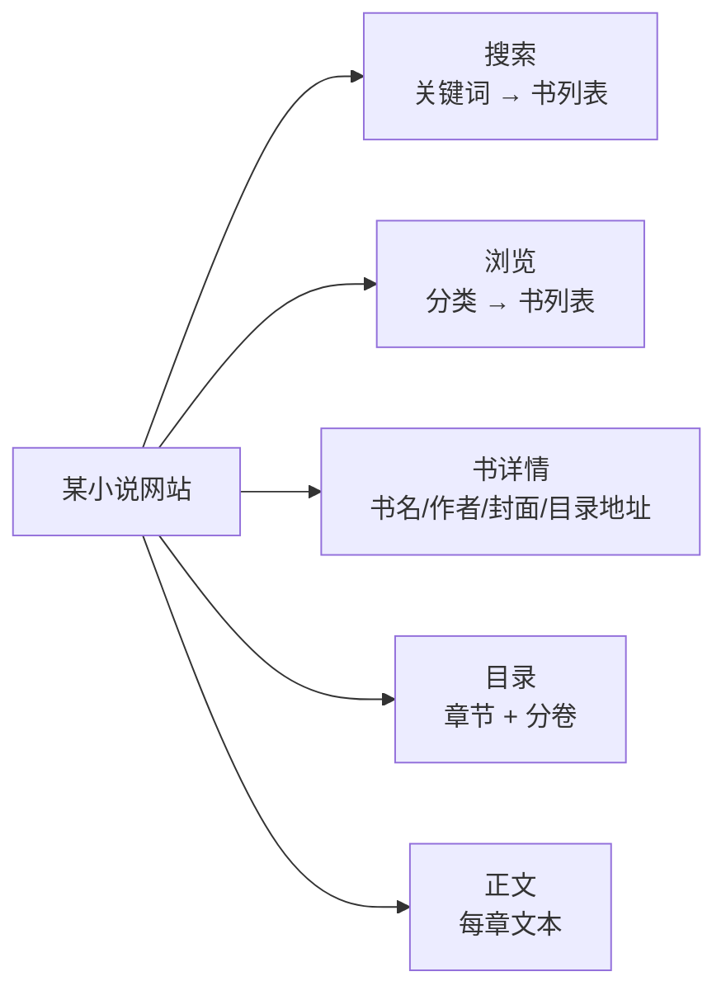

难点不在「抓」,而在「**怎么把抓取规则写下来**」,并且这份写法要同时满足三个看似矛盾的要求:

- **人能读、能改**——网站改版了要能快速修;
- **机器能静态检查**——别等运行时才发现规则写错;
- **AI 能生成**——让大模型据网站直接产出,而不是人肉逆向。

传统书源(如 Legado)用的是**紧凑字符串 DSL**:

```text
[property=og:novel:book_name]@content##简介:
.listmain dd a@href
```

它很省字,但对上面三个要求都不友好:一行字符串里混着选择器、属性、正则、分隔符,工具无法静态理解它,AI 生成时也极易在转义和优先级上翻车。

所以 TRNovel 的书源换了一种表达:**把每个字段都变成一个结构化的「规则对象」**。这就是整篇文章的起点。

---

## 二、核心抽象:每个字段都是一棵「规则树」

一条规则,要么是一次**抽取**(叶子),要么是一个**组合子**(把子规则组合起来)。它本质是一棵语法树:

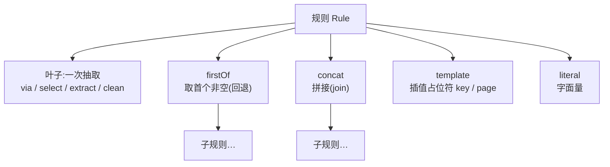

对应到 JSON,「书名」从一行字符串变成了一个对象:

```jsonc
// 旧:紧凑 DSL —— 工具看不懂,AI 易错
"name": "[property=og:novel:book_name]@content"

// 新:结构化规则 —— 字段含义一目了然
"name": { "via": "css", "select": "[property=\"og:novel:book_name\"]", "extract": { "attr": "content" } }
```

这棵树在 Rust 里就是一个 `enum`(用 serde 的 `untagged`,所以 JSON 里不需要写「类型标签」,靠字段形状自动区分):

```rust
// 一条规则:要么是叶子,要么是组合子(简化版)
#[serde(untagged)]
pub enum Rule {
    FirstOf { first_of: Vec<Rule> },              // 取首个非空
    Concat  { concat: Vec<Rule>, join: String },  // 拼接
    Literal { literal: String },                  // 字面量
    Template { template: String },                // 模板插值
    Leaf(LeafRule),                               // 一次抽取
}

// 叶子:在「当前上下文」上做一次抽取
pub struct LeafRule {
    pub via: Via,                 // css / json / regex / raw
    pub select: Option<String>,   // 选择器
    pub index: Option<i64>,       // 取第几个
    pub extract: Extract,         // text / html / {attr} ...
    pub clean: Vec<CleanStep>,    // 后处理流水线
}
```

这一步看似只是「啰嗦了一点」,但它把书源从「一段需要专门解析器的迷你语言」变成了「一棵普通的数据结构树」。**树是能被遍历、被校验、被生成的**——后面所有能力都建立在这个选择之上。

这在设计模式上叫 **Interpreter + Composite**:配置本身就是解释器要遍历的语法树,组合子(firstOf/concat)是 Composite 节点——`enum` 的递归定义,天然就是一棵 Composite。

---

## 三、求值:一条规则怎么变成一个值

引擎对外只有两个动作:`eval_value`(求一个值,如书名)和 `eval_list`(求一组上下文,如「所有章节条目」)。求值就是**递归遍历这棵规则树**:

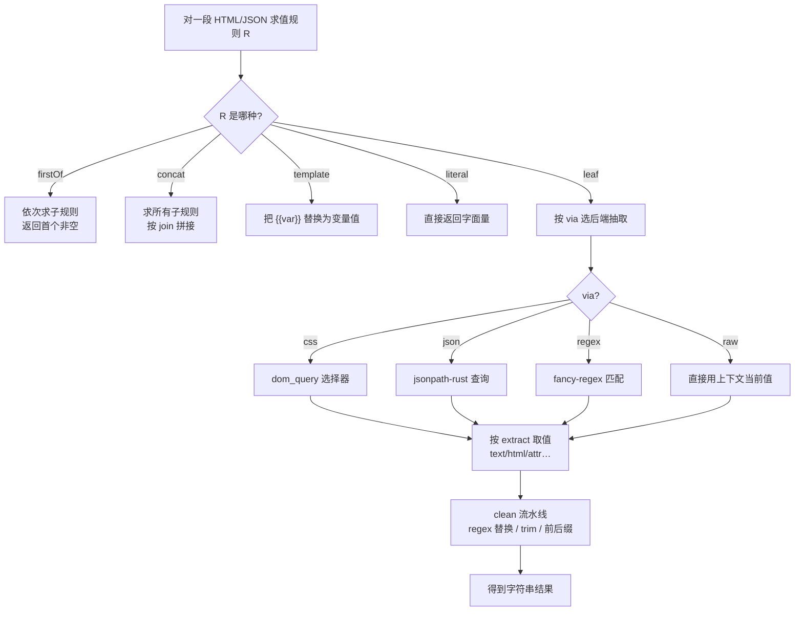

翻译成代码,`eval_value` 就是对这棵树做模式匹配、递归下降:

```rust
fn eval_value(rule: &Rule, ctx: &str, vars: &Vars) -> Result<String> {
    match rule {
        // 组合子:递归求子规则
        Rule::FirstOf { first_of } => first_of.iter()
            .find_map(|r| eval_value(r, ctx, vars).ok().filter(|s| !s.is_empty()))
            .unwrap_or_default(),
        Rule::Concat { concat, join } => concat.iter()
            .filter_map(|r| eval_value(r, ctx, vars).ok()).filter(|s| !s.is_empty())
            .collect::<Vec<_>>().join(join),
        Rule::Template { template } => interpolate(template, vars),  // {{key}} → 值
        Rule::Literal { literal } => literal.clone(),
        // 叶子:选后端抽取,再过 clean 流水线
        Rule::Leaf(leaf) => {
            let raw = backend::extract(leaf, ctx)?;   // ← 下面这个 match
            apply_clean(&leaf.clean, raw)
        }
    }
}
```

这里有两个值得讲的设计点:

**1. 后端用 Strategy 模式按 `via` 静态分派。** css 走 [dom_query](https://crates.io/crates/dom_query),json 走 JSONPath,regex 走 fancy-regex,raw 直接用当前值。求值器不关心后端细节,只按 `via` 选一个策略:

```rust
fn extract(leaf: &LeafRule, ctx: &str) -> Result<String> {
    match leaf.via {
        Via::Css   => css_select(ctx, leaf),       // dom_query
        Via::Json  => json_query(ctx, leaf),       // jsonpath-rust
        Via::Regex => regex_extract(ctx, leaf),    // fancy-regex
        Via::Raw   => Ok(ctx.to_string()),         // 直接用当前值
    }
}
```

好处是**加一种抽取方式只是加一个分支**,且每种后端都能独立测试。

**2. `select` 是 self-or-descendant 语义。** 在「某个章节条目」这个上下文上写 `a@href`,既能匹配条目本身是 `<a>` 的情况,也能匹配条目内部的 `<a>`。这让 `list`(选出所有条目)+ `item`(在每个条目上抽字段)这种两段式写法非常自然。

把它放进引擎的「五个操作」里,你会发现它们共享同一套骨架——这是 **Template Method**:

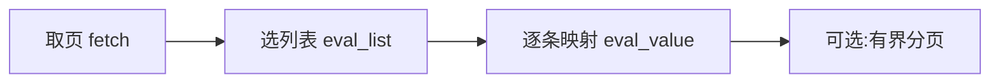

搜索、浏览、目录、正文都是这条骨架的实例化,只是规则和是否分页不同。

---

## 四、分层:让规则逻辑和「怎么联网」彻底分开

整个引擎按职责切成几层,关键是把**「取页」**单独抽象成一个端口:

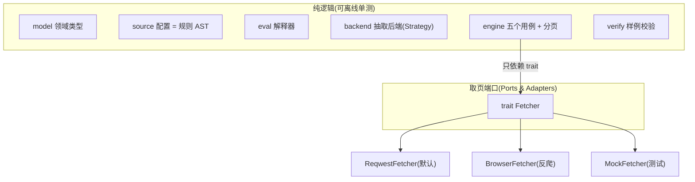

这个端口本身极小——它只负责「给一个 URL,把解码后的正文拿回来」:

```rust
#[async_trait]
pub trait Fetcher: Send + Sync {
    async fn fetch(&self, req: FetchRequest) -> Result<String, FetchError>;
}
```

引擎所有用例都只调这一个方法,完全不知道背后是 reqwest、是浏览器、还是测试桩。为什么要把取页做成端口?两个红利:

- **离线可测**:给引擎喂一个返回固定 HTML 的 `MockFetcher`,就能在没有网络的情况下测「规则求值 + 分卷切分」是否正确——规则的正确性不依赖真实网站;
- **反爬可插拔**:解 Cloudflare 的浏览器后端,只是 `trait Fetcher` 的**又一个实现**,引擎完全不用改。

这正是依赖倒置:`engine` 依赖抽象 `Fetcher`,而不是某个具体的 HTTP 客户端。

---

## 五、章节与分卷:一个列表 + 一个判别式

目录是最容易写歪的地方。很多站的目录里,**卷标题**和**章节链接**是混在一起、按阅读顺序排列的:

```text
第一卷 蛊师          ← 卷
  第1章 出谷         ← 章
  第2章 …
第二卷 罡气          ← 卷
  第3章 …
```

朴素做法是「用一个选择器选卷、另一个选章」,但这样**会丢掉它们之间的先后顺序**——你不知道某一章属于哪一卷。

TRNovel 的原理是:**用一个 `list` 选择器把卷和章一起选出来、保持文档顺序,再用一条 `isVolume` 判别规则区分二者**:

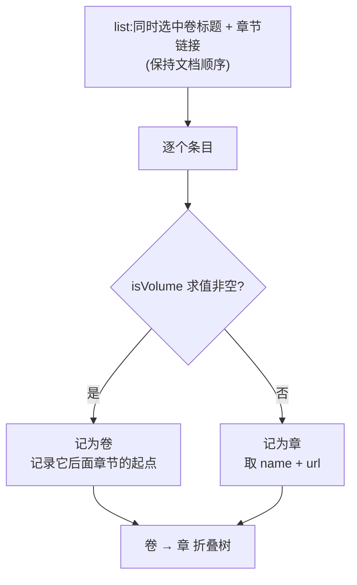

切分逻辑就是一次线性遍历:

```rust
for item in eval_list(&toc.list, page)? {          // 按文档顺序拿到「卷+章」混合列表
    let title = eval_value(&toc.name, &item, &vars)?;
    let is_volume = match &toc.is_volume {
        Some(r) => !eval_value(r, &item, &vars)?.trim().is_empty(), // 判别式:非空=卷
        None => false,                                              // 没配 isVolume = 全是章
    };
    if is_volume {
        volumes.push(Volume { title, first_chapter_index: chapters.len() }); // 记下卷起点
    } else {
        let url = eval_value(&toc.url, &item, &vars)?;
        chapters.push(Chapter { title, url, is_volume: false });
    }
}
```

`isVolume` 通常是「选卷标题特有的元素(如 `h2`)」——对卷节点求值非空、对章节求值为空。注意 `first_chapter_index: chapters.len()`:卷只记下「我后面的章从第几个开始」,顺序信息就这么一次遍历里固定下来了。这个设计的精髓是:**顺序信息只在一次遍历里产生,不需要二次对齐**。

> 实战里还有个常见坑:目录开头往往有一块「最新章节」预览(倒序、且和正文区重复)。解法同样是「用结构区分」——用兄弟选择器只取「正文标记之后」的章节,而不是按文本去猜。

---

## 六、反爬的原理:把浏览器当一台「cookie 烤箱」

有些站(如 bilixs)对**搜索**这类端点开了 Cloudflare 的 Managed Challenge:普通 HTTP 请求拿回来的不是内容,而是一张「正在验证你是不是真人」的 JS 挑战页。

### 6.1 先想清楚:这关到底卡在哪

实测结论很关键——它是**路径级的 WAF 规则**,不是按指纹判定的:

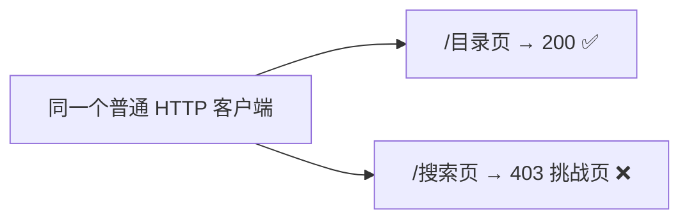

同一个客户端,目录能拿到、搜索被挑战。这说明**伪装 TLS 指纹没用**(指纹再像,路径规则照样挑战),也说明**读书几乎不受影响,只有搜索这类端点要过关**。而 Managed Challenge 要过,必须**真正执行那段挑战 JS**——这是普通 HTTP 客户端做不到的。

### 6.2 核心原理:浏览器只「领通行证」,干活还是交给快请求

关键的设计选择是:**不要把每个请求都塞进浏览器**(那样太慢),而是用真实浏览器**只解一次挑战、领一张 `cf_clearance` 通行证**,然后把这张通行证交还给快速的 reqwest 去干活。像一台「cookie 烤箱」:进去烤一张通行证,出来继续用普通请求。

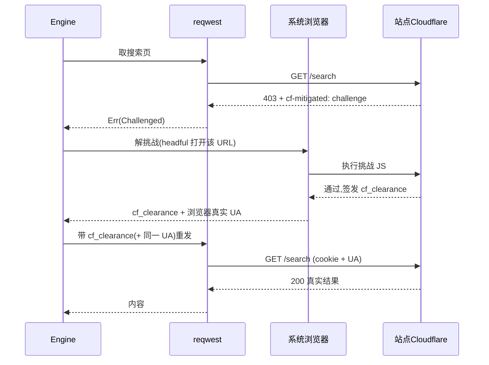

这套「撞墙→解挑战→拿通行证→复用」被收敛成一个**装饰器式的 `Fetcher`**:它包住普通 reqwest,只有撞到挑战才升级到浏览器,且通行证解一次、之后复用:

```rust
// EscalatingFetcher:撞挑战才升级浏览器,通行证缓存复用(简化版)
async fn fetch(&self, mut req: FetchRequest) -> Result<String, FetchError> {
    self.apply_clearance(&mut req).await;            // 有通行证就带上
    match self.reqwest.fetch(req.clone()).await {
        Err(FetchError::Challenged(msg)) => {
            let Some(browser) = &self.browser else { return Err(Challenged(msg)); };
            let mut guard = self.clearance.lock().await;   // 串行化:只解一次
            if guard.is_none() {
                if browser.ui().authorize(&self.name).await == Deny {   // 征求用户授权
                    return Err(Challenged("未授权".into()));
                }
                *guard = Some(browser.solve(&abs).await?);  // 烤一张通行证
            }
            drop(guard);
            self.apply_clearance(&mut req).await;           // 带通行证重试
            self.reqwest.fetch(req).await
        }
        other => other,    // 没撞挑战,原样返回
    }
}
```

引擎对它无感——它也只是 `trait Fetcher` 的一个实现。这里有两个「实测踩出来」的硬约束:

- **必须 headful**:无头浏览器会被 Cloudflare 识别而解不开,真实可见的浏览器才行;
- **通行证绑 UA**:`cf_clearance` 和签发它的 User-Agent 绑定。所以浏览器解完后必须把**真实 UA** 一并交出,reqwest 后续请求要用同一个 UA,否则通行证会被拒。

### 6.3 自适应挑战:有时需要用户点一下

Managed Challenge 是**自适应**的:风险低时它自己跑非交互 JS(用户无感);风险高时会升级成一个「确认您是真人」的勾选框(Turnstile),这个**只能让真人点**——程序模拟点击会被识别。

所以「解挑战」不能闷头跑,得能跟 UI 交互。引擎对 UI 的依赖同样抽象成一个 trait,TUI 去实现它:

```rust
#[async_trait]
pub trait BrowserUi: Send + Sync {
    async fn authorize(&self, source_name: &str) -> AuthDecision; // 撞挑战前问:本次/总是/拒绝
    fn prompt_click(&self, url: &str, cancel: Arc<AtomicBool>);   // Turnstile 出现:提示去点
    fn done(&self);                                              // 解完:撤下提示
}
```

`authorize` 是 `async` 的——它能**挂起解挑战、等用户在弹窗里做决定**;`prompt_click` 给一个 `cancel` 标志,用户取消就置真、解挑战循环随即中止。这样解挑战就成了一个状态机:

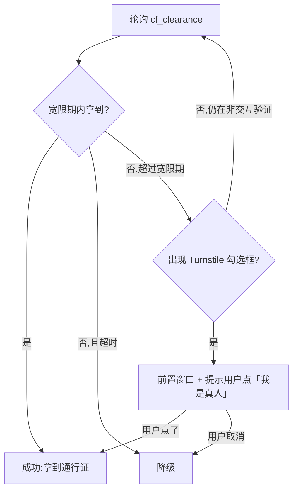

而「要不要为了一个搜索去打开用户的浏览器」是个隐私/打扰问题,所以加了**两级授权**(取交集):书源声明需要(`http.fetcher`)∧ 用户允许(首次弹窗「本次/总是/拒绝」或设置开关)。不授权就老老实实降级。

### 6.4 优雅降级:把「失败」做成「被理解的状态」

整条链路任何一环走不通,都不该是一个吓人的崩溃,而该是一个**被理解、有替代路径**的状态:

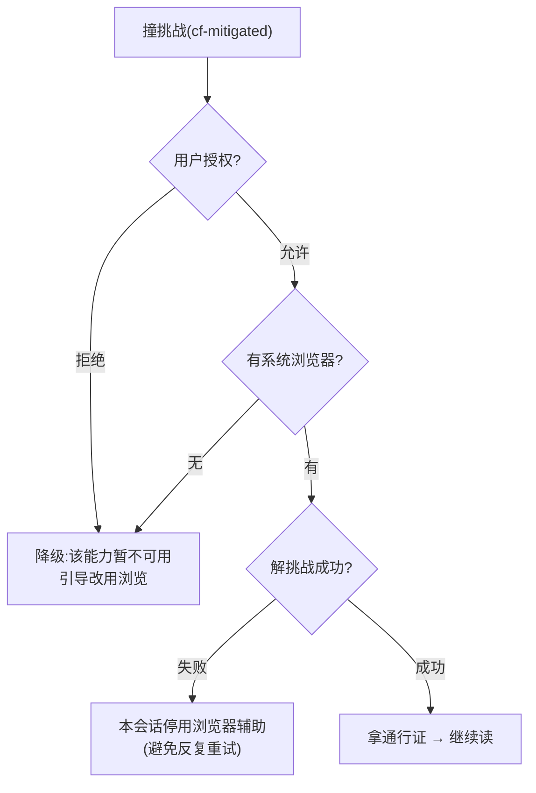

`doctor`(下一节)会把「被挑战」识别成一句精确的诊断——「需浏览器辅助或改用浏览」,而不是一行裸报错。

### 6.5 这套并发为什么难写(几条原理性的坑)

把浏览器接进一个异步 TUI,真正难的是并发协调。几条用血换来的原理:

- **决定不能绑在某次取页的 future 上**:授权弹窗如果用「随这次请求存活的一次性通道」来等用户,一旦页面重渲染/取消重跑,通道被丢弃 → 误判成「拒绝」→ 报错又弹窗,来回抖动。正解:**把用户的决定存到会话级的共享状态里,弹窗只在「当前没有弹窗」时弹一次**,所有等待者复用同一个决定。
- **解挑战要串行化**:并发取页若各自去开浏览器,会开出好几个窗口。正解:**持一把锁,期间别人直接复用已领到的通行证**。
- **失败要「熔断」**:浏览器一启动就退出时,如果页面在错误上反复重跑,就会**反复开浏览器(频闪)**。正解:**一旦解挑战失败,本会话就停用、直接降级**。
- **独占 profile 的残留锁要清**:上次异常退出留下的 `SingletonLock` 会让新实例一启动就退。启动前清掉它(这个 profile 是我们独占的,清理安全)。
- **别因一个事件就掐断 CDP 连接**:驱动浏览器连接的事件循环,如果遇到单个错误事件就退出,会取消正在进行的命令(报 `oneshot canceled`)。要持续驱动到连接真正关闭。

这些都不是「业务逻辑」,而是「把一个有状态、可取消、会失败的外部进程,接进一个会频繁重渲染的 UI」时必然要面对的协调问题。

---

## 七、让书源「自我验证」:可执行的不变量

书源是爬虫配置,会随网站改版失效。怎么知道一份书源还好不好用?TRNovel 的原理是:**把每个能力的「成功长什么样」写成可执行的断言**,然后真跑一遍。

`trn doctor <书源.json>` 就是干这个的:

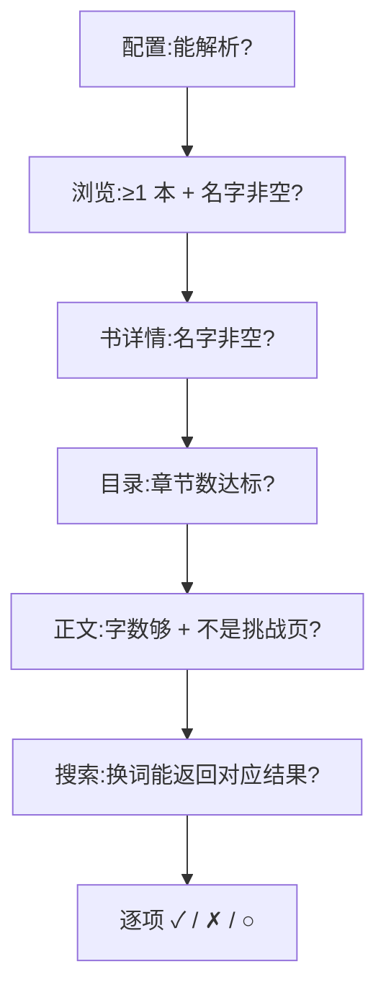

每一项都不是「检查字段在不在」,而是「真跑一遍、断言结果合理」:

```rust
// 目录这一项的体检(简化版)
match engine.toc(&toc_url).await {
    Ok(toc) if !toc.chapters.is_empty() =>
        Check::pass("目录", format!("{} 卷 / {} 章", toc.volumes.len(), toc.chapters.len())),
    Ok(_)  => Check::fail("目录", "无章节"),
    // 撞反爬不报裸错,给精确诊断
    Err(e) if e.is_challenge() => Check::fail("目录", "被反爬挑战拦截,需浏览器辅助或改用浏览"),
    Err(e) => Check::fail("目录", e.to_string()),
}
```

精髓有两点:

- **断言是「可执行不变量」**:不是「字段存在」,而是「换两个关键词搜索,结果会跟着变(而不是固定榜单)」「正文不是一张挑战页」这种真正反映「能用」的判断;
- **同一套断言两用**:既用于 AI 生成期的「改到全绿」,也用于运行期的健康体检。

校验通过后,`trn import` 把它写进 `~/.novel`,书源就能在阅读器里直接选用——`生成 → 校验 → 导入` 闭成一环。

---

## 八、Schema 不漂移:从类型生成,而不是手写

书源有一份 JSON Schema(给编辑器补全、给 AI 当约束)。手写 schema 必然和 Rust 类型**漂移**——我们就真踩过:schema 写 `utf-8`,引擎实际只认 `utf8`。

原理很简单:**让 schema 从类型自动生成,只保留一个真相源**。

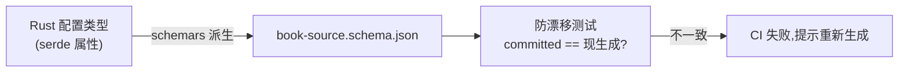

落地就两步——给类型加一个派生,再写一个「现生成 == 已提交」的 golden 测试:

```rust
// 1) 给配置类型加派生(feature 门控,不增重默认构建)
#[cfg_attr(feature = "schema", derive(schemars::JsonSchema))]
pub struct BookSource { /* ... */ }

// 2) 防漂移测试:committed 的 schema 必须等于「现从类型生成的」
#[test]
fn schema_is_in_sync() {
    let generated = serde_json::to_string_pretty(&schemars::schema_for!(BookSource)).unwrap();
    let committed = include_str!("../book-source.schema.json");
    assert_eq!(generated.trim(), committed.trim(),
        "schema 与类型不同步,请重新生成");   // 改了类型忘生成 → CI 红
}
```

`schemars` 派生会**尊重 serde 属性**——`rename_all`、`untagged`、`skip_serializing_if` 都自动反映到 schema 里。我们手抄会犯的那类错(`utf-8` vs `utf8`),从生成的角度根本不可能出现。有了那个 golden 测试,改了类型却忘了重新生成,CI 就会红。从此改类型,schema 自动跟上。

---

## 九、闭环:为什么 AI 能直接生成书源

把前面的设计连起来看,会发现它们共同服务于一个目标:**让做书源这件事,从「人肉逆向」变成「AI 可完成的闭环」**。

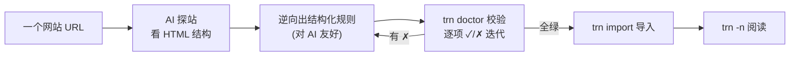

这个闭环之所以成立,正是因为前面每一个设计决策:

- 规则是**结构化树**(第二节)→ AI 能可靠生成与修改;
- schema **从类型生成、不漂移**(第八节)→ AI 有准确的约束;
- doctor 是**可执行不变量**(第七节)→ AI 有客观的「改到对」的信号;
- 反爬被收敛成**一个可降级的取页适配器**(第六节)→ 难站也能尽量接入,接不动就诚实降级;
- import 把它**一键变得可用**→ 闭环最后一步。

---

## 结语

如果要把这套设计浓缩成一句话:

> **把「怎么抓一个网站」这种经验,编码成「可声明、可校验、可生成」的结构。**

- 「可声明」靠规则 AST + 分层架构;
- 「可校验」靠 doctor 的可执行不变量 + 从类型生成的 schema;
- 「可生成」是前两者的自然结果——当一份配置既结构清晰又能客观判对错,AI 就能接管那条最枯燥的「逆向」工序。

反爬那部分则是另一类问题的缩影:**怎么把一个有状态、会失败、需要人偶尔介入的外部能力,干净地接进一个纯函数式的引擎和一个会频繁重渲染的 UI**——答案是端口隔离、会话级状态、串行化与熔断,以及把失败做成「被理解的降级」。
