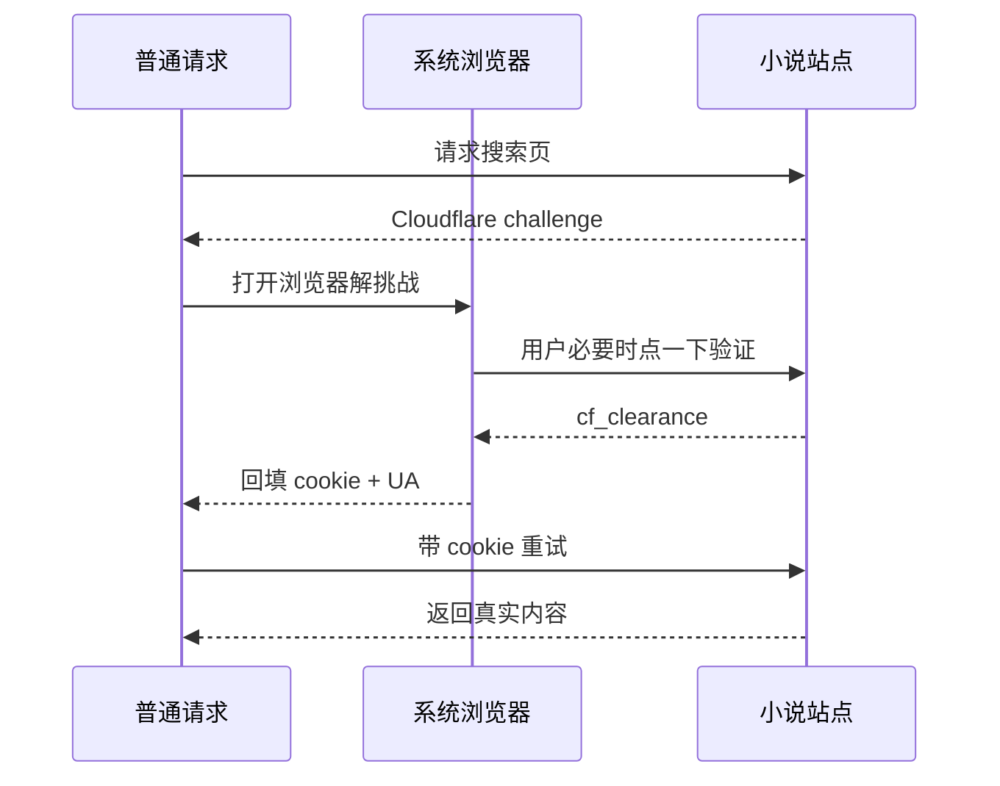

# 我把终端小说阅读器接上了 AI Agent：TRNovel 现在能用 skill 生成书源了

> 一篇 TRNovel 的阶段性复盘，也是一篇安利文。
> 如果说上一篇文章是在介绍「我做了一个终端小说阅读器」，那这篇更像续集：当时 TRNovel 刚到 0.5.1，主打本地 TXT、网络书源、历史记录、主题设置，以及 npm / cargo / Release 安装；一年多后，它已经慢慢长成了一个本地优先、跨平台分发、支持听书、能让 AI 帮你生成书源的阅读工具箱。
>
> 前面几篇关于 TRNovel 的文章可以按时间顺序看：
> - [TRNovel：一个专为小说爱好者打造的终端阅读器](https://juejin.cn/post/7461629792724156431?searchId=20260601223038245B11615D6657D40BD6)：0.5.1 时的首次开源介绍。
> - [TRNovel王者归来：让小说阅读"声"临其境的终端神器](https://juejin.cn/post/7567208390368837672)：讲 ratatui-kit 声明式重构、文档和听书功能。
> - [用 cargo-dist 接管 Rust CLI 的发布：以 TRNovel 为例](https://juejin.cn/post/7644745737152888867)：讲 TRNovel 如何把发布链路收敛到 cargo-dist。

## 先说结论

TRNovel 现在不只是一个「终端小说阅读器」。

它现在更像是下面这几件事的组合：

1. 一个用 Rust + Ratatui 写的跨平台 TUI 阅读器；
2. 一个本地优先的 TXT 小说阅读工具，支持章节识别、分卷、历史记录和主题；
3. 一个网络小说书源引擎，使用结构化的 `trnovel-booksource/v2` 配置描述站点规则；
4. 一个带 `doctor` 体检命令的书源验证器；
5. 一个可以通过 Agent skill 自动生成书源的 AI 工作流；
6. 一个支持 npm、Homebrew、Cargo、shell / PowerShell 一键脚本的 Rust CLI。

换句话说，TRNovel 这段时间的核心变化不是「又加了几个按钮」，而是开始回答一个更现实的问题：

> 在 AI Agent 已经能读网页、写代码、跑命令的时代，一个开源小说阅读器应该怎么跟上新的工作流？

我的答案是：**阅读器负责稳定阅读，书源格式负责可维护，doctor 负责验证，skill 负责把复杂站点接入过程交给 AI。**

如果把几篇文章串起来看，TRNovel 的变化大概是这样：

| 阶段 | 主要变化 | 解决的问题 |
|---|---|---|
| 0.5.1 初版开源 | 本地 TXT、网络书源、历史记录、主题、npm/cargo/Release 安装 | 先让终端阅读器跑起来 |
| ratatui-kit 重构 | 声明式 UI、完整文档、Kokoro TTS 听书 | 解决维护性和阅读体验 |
| cargo-dist 发布 | shell / PowerShell 一键脚本、npm、Homebrew、GitHub Release 统一发布 | 降低安装门槛和发版成本 |
| 当前阶段 | v2 结构化书源、`trn doctor`、反爬诊断、`booksource-generator` skill | 让网络书源更适合 AI 生成和维护 |

## 目录

- [TRNovel 是什么](#trnovel-是什么)
- [安装方式要跟上普通用户](#安装方式要跟上普通用户)
- [书源格式要对人和 AI 都友好](#书源格式要对人和-ai-都友好)
- [书源不能只靠猜，要能体检](#书源不能只靠猜要能体检)
- [通过 skill 创建书源](#通过-skill-创建书源)
- [反爬不能装作不存在](#反爬不能装作不存在)
- [现在如何安装和体验](#现在如何安装和体验)
- [后面还想做什么](#后面还想做什么)

## TRNovel 是什么

TRNovel，全名 Terminal Reader for Novel，是一个终端小说阅读器。

如果你日常有这些习惯，它大概率会比较适合你：

- 喜欢在终端里解决事情；
- 有一堆本地 TXT 小说，不想再开一个臃肿阅读器；
- 希望阅读历史、主题、缓存都留在本地；
- 想把网络小说站点接进来，但不想被固定书源生态锁死；
- 对 Rust CLI、TUI、AI Agent 工作流感兴趣。

现在的 TRNovel 支持：

- 本地 TXT 阅读；
- 章节与分卷识别；
- 网络小说书源；
- 阅读历史；
- 主题配置；
- Kokoro TTS 听书；
- `trn doctor` 书源体检；
- `booksource-generator` skill 自动生成书源；
- Windows / macOS / Linux 多平台安装。

这听起来像是一个功能列表，但背后其实是一条很清晰的演进路线：**从「能读」到「好装」，再到「好扩展、好验证、好交给 AI 维护」。**

## 安装方式要跟上普通用户

上一篇文章里，TRNovel 已经支持了三种安装方式：npm、cargo、手动下载 Release。

这在当时已经够用了，但门槛依然有点高：

- npm 适合有 Node.js 环境的人；
- cargo 适合有 Rust toolchain 的人；
- Release 压缩包适合愿意自己下载、解压、配置 PATH 的人。

用户只是想试试一个阅读器，你不能总指望他已经装好 Node 或 Rust，也不能指望他愿意手动折腾环境变量。

后来 TRNovel 用 cargo-dist 接管了发布，把一个 Rust CLI 发到了多个渠道：

```bash
# macOS / Linux 一键安装
curl --proto '=https' --tlsv1.2 -LsSf \
  https://github.com/yexiyue/TRNovel/releases/latest/download/trnovel-installer.sh | sh

# Homebrew
brew install yexiyue/tap/trnovel

# npm / pnpm
pnpm add -g @trnovel/trnovel

# Cargo
cargo install trnovel
```

Windows 用户也可以直接用 PowerShell：

```powershell
powershell -ExecutionPolicy Bypass -c "irm https://github.com/yexiyue/TRNovel/releases/latest/download/trnovel-installer.ps1 | iex"
```

这件事对项目推广很重要。

开源项目很多时候不是输在能力，而是输在第一步：用户看完 README，发现要装一堆环境，兴趣就没了。

TRNovel 现在的目标是：**你想试，复制一条命令就能试。**

## 书源格式要对人和 AI 都友好

TRNovel 一开始的网络书源解析思路更接近 Legado：很多规则写在紧凑字符串里。

这种格式的优点是生态成熟、表达短。

但它也有一个很明显的问题：对机器和 AI 都不够友好。

比如一条规则字符串里可能同时揉进：

- CSS 选择器；
- JSONPath；
- 正则清理；
- 字符串拼接；
- 变量读写；
- 多候选 fallback；
- 分页循环。

人写久了会熟，机器读起来很别扭，AI 生成时也容易把边界写错。

所以 TRNovel 现在推荐的是 `trnovel-booksource/v2`：一份结构化 JSON。

大概长这样：

```json
{
  "schema": "trnovel-booksource/v2",
  "name": "示例书源",
  "url": "https://example.com",
  "search": {},
  "explore": {},
  "bookInfo": {},
  "toc": {},
  "content": {},
  "samples": []
}
```

它的核心思路是：**不要把规则压成一条聪明但脆弱的字符串，而是把规则拆成明确字段。**

v2 书源可以声明：

| 模块 | 负责什么 |
|---|---|
| `search` | 搜索请求和结果抽取 |
| `explore` | 分类浏览和分页 |
| `bookInfo` | 书名、作者、封面、简介、目录地址 |
| `toc` | 章节列表、分卷、章节 URL |
| `content` | 正文选择器、分页正文、清理规则 |
| `http` | 请求头、字符集、超时、重试、浏览器辅助 |
| `samples` | 真实样例，用来驱动 doctor 校验 |

这里有一个取舍：TRNovel v2 当前不直接兼容 Legado 书源格式。

这不是没考虑生态，而是一个主动选择：运行时先保持干净，未来再提供一个独立的转换 skill，把 Legado 书源迁移成 TRNovel v2 格式。

也就是说，方向不是「在运行时背上所有旧格式包袱」，而是：

```text
Legado 书源 -> 转换 skill -> TRNovel v2 书源 -> doctor 校验 -> 导入使用
```

我更喜欢这个方向，因为它更符合 AI Agent 时代的工作流。

## 书源不能只靠猜，要能体检

写过书源的人都知道，书源最麻烦的不是写出来，而是确认它真的能用。

一个网站接入通常至少包含这些步骤：

1. 能不能搜索？
2. 能不能分类浏览？
3. 能不能打开书籍详情？
4. 能不能拿到目录？
5. 目录是不是顺序正确？
6. 有没有分卷？
7. 能不能拿到正文？
8. 正文有没有乱码？
9. 有没有被反爬挡住？

如果这些都靠人肉点界面测试，维护成本会很高。

所以 TRNovel 加了一个命令：

```bash
trn doctor ./example.v2.json
```

它会对书源跑一遍完整诊断：

```text
书源诊断: 示例书源
  ✓ 配置      书源可解析
  ✓ 浏览      30 本
  ✓ 书详情    示例小说
  ✓ 目录      2 卷 / 1260 章
  ✓ 正文      1800 字
  ✓ 搜索      关键词 -> 20 本

✓ 全部通过
```

`doctor` 的意义不只是给用户看一个结果，它还改变了书源开发方式。

以前写书源靠感觉：

```text
我觉得这个选择器应该对。
```

现在写书源靠反馈：

```text
doctor 告诉我正文为空，那我只修 content 规则。
doctor 告诉我搜索被挑战，那这是反爬问题，不是选择器问题。
doctor 告诉我目录只有 5 章，那说明我抓到了“最新章节”区域，不是真目录。
```

这就为下一步铺好了路：让 AI Agent 参与。

## 通过 skill 创建书源

这是我觉得 TRNovel 最近最值得拿出来讲的变化。

TRNovel 仓库里现在内置了一个 skill：

```text
skills/booksource-generator
```

安装方式：

```bash
npx skills add https://github.com/yexiyue/TRNovel/tree/main/skills/booksource-generator
```

安装后，你可以直接对支持 skills 的 Agent 说：

```text
请使用 booksource-generator skill，
为 https://example.com 生成一个 TRNovel v2 书源。
生成后运行 trn doctor 校验，修到通过后把 JSON 给我。
```

这件事听起来像「AI 帮我写 JSON」，但实际价值比这个大。

因为书源不是普通配置，它需要 Agent 做一整套探站工作：

- 抓首页；
- 找搜索表单；
- 看分类页结构；
- 找一本书的详情页；
- 抽 `og:novel:*` meta；
- 找目录页；
- 区分「最新章节」和「完整目录」；
- 找正文容器；
- 判断字符集；
- 判断是不是反爬挑战页；
- 写出 v2 JSON；
- 跑 `trn doctor`；
- 根据失败项迭代修正。

这恰好是 AI Agent 擅长的事：读网页、试规则、跑命令、看错误、再修。

而 TRNovel 要做的，是给 Agent 一个稳定的落点：


这也是我说 TRNovel 在「与时俱进」的原因。

不是为了蹭 AI 热度，而是把 AI 用在一个真实、重复、细碎、但很适合自动化的地方：**生成和维护书源。**

## 反爬不能装作不存在

网络小说站点还有一个现实问题：反爬。

尤其是搜索端点，经常会遇到 Cloudflare 之类的挑战页。

以前这类问题很容易被写成一句模糊报错：

```text
搜索失败
```

但用户不知道到底是规则错了、网站挂了、编码错了，还是被挑战页挡住了。

TRNovel 现在的做法是把它显式诊断出来。

如果某个端点返回挑战页，`doctor` 会报告类似：

```text
被反爬挑战拦截，需浏览器辅助或改用浏览
```

TRNovel 还支持一种「cookie 烤箱」式的浏览器辅助：



这套方案的边界也很明确：

- 能自动就自动；
- 必要时让用户点一下；
- 浏览器只是解挑战，不把整个阅读链路变成重型浏览器渲染；
- 如果搜索被挡但分类浏览可用，就优雅降级；
- `doctor` 把状态说明白。

对阅读器来说，这比「失败了你自己猜」要友好很多。

## 现在如何安装和体验

如果你只是想试试 TRNovel，直接装：

```bash
curl --proto '=https' --tlsv1.2 -LsSf \
  https://github.com/yexiyue/TRNovel/releases/latest/download/trnovel-installer.sh | sh
```

Windows：

```powershell
powershell -ExecutionPolicy Bypass -c "irm https://github.com/yexiyue/TRNovel/releases/latest/download/trnovel-installer.ps1 | iex"
```

也可以用：

```bash
brew install yexiyue/tap/trnovel
pnpm add -g @trnovel/trnovel
cargo install trnovel
```

常用命令：

```bash
trnovel              # 打开主界面
trnovel -l ./novels  # 阅读本地小说目录
trnovel -n           # 网络小说模式
trnovel -q           # 继续上次阅读
trn doctor source.v2.json
```

如果你想体验 AI 生成书源：

```bash
npx skills add https://github.com/yexiyue/TRNovel/tree/main/skills/booksource-generator
```

然后把目标小说站 URL 发给 Agent，让它使用 `booksource-generator`。

## 后面还想做什么

TRNovel 接下来最想补上的，是 Legado 转 TRNovel v2 的转换 skill。

TRNovel v2 现在不直接兼容 Legado 书源。

但 Legado 生态确实有大量现成经验，直接丢掉也可惜。

所以更合理的方式不是运行时兼容旧格式，而是提供一个转换 skill：

```text
Legado JSON -> 转换 skill -> TRNovel v2 JSON -> trn doctor -> 可用书源
```

这既能吃到生态，又不会把运行时规则引擎重新拖回复杂字符串 DSL。

## 最后

TRNovel 这个项目一开始只是「我想在终端里看小说」。

但做着做着，它变成了一个很有意思的实验场：

- Rust CLI 怎么跨平台分发？
- TUI 阅读器怎么保持轻量？
- 网络书源格式怎么更适合 AI？
- Agent skill 能不能真的降低用户接入站点的门槛？

这些问题看起来很小，但都是真实用户会遇到的问题。

如果你也喜欢终端工具、Rust、小说阅读，或者正在研究 AI Agent 能在开源项目里做什么，可以试试 TRNovel。

相关链接：

- GitHub：[https://github.com/yexiyue/TRNovel](https://github.com/yexiyue/TRNovel)
- 使用文档：[https://yexiyue.github.io/TRNovel](https://yexiyue.github.io/TRNovel)
- npm：[@trnovel/trnovel](https://www.npmjs.com/package/@trnovel/trnovel)
- crates.io：[trnovel](https://crates.io/crates/trnovel)
- 0.5.1 初版介绍：[TRNovel：一个专为小说爱好者打造的终端阅读器](https://juejin.cn/post/7461629792724156431?searchId=20260601223038245B11615D6657D40BD6)
- 声明式重构与听书：[TRNovel王者归来：让小说阅读"声"临其境的终端神器](https://juejin.cn/post/7567208390368837672)
- cargo-dist 发布链路：[用 cargo-dist 接管 Rust CLI 的发布：以 TRNovel 为例](https://juejin.cn/post/7644745737152888867)
