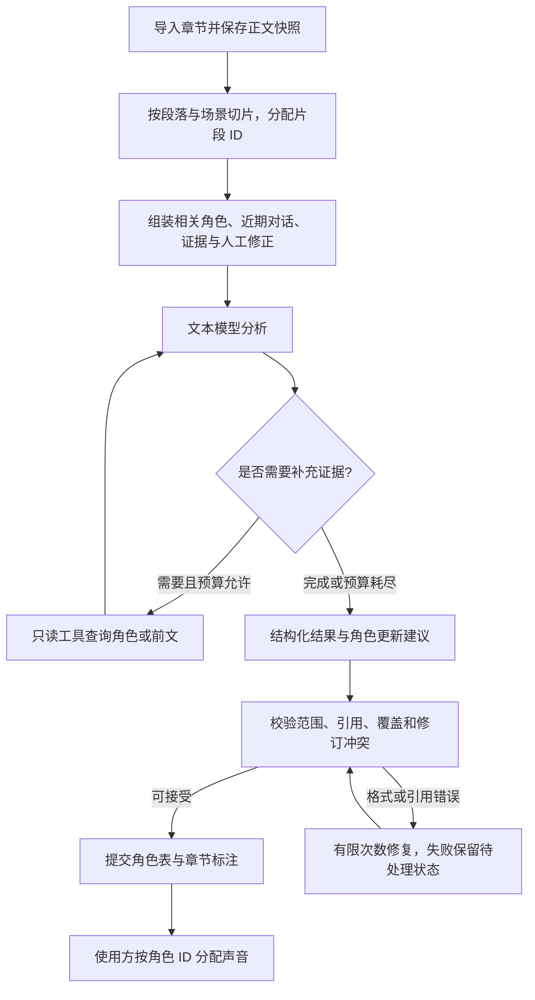

# 小说角色分析项目企划

日期：2026-10-05。状态：独立仓库的实现计划，尚未创建仓库或实现代码。

## 项目定位与目标

做一个独立的 Rust 项目，把小说原文转换为可复用的角色表和章节标注。TRNovel 是第一个使用方，用标注结果实现多角色听书；其他阅读器或内容工具也可以使用。

同时继续 `../rust-agent/comfy-agent` 的学习：从固定分析流程开始，再加入工具调用、上下文组装、持久化记忆、执行记录和断点恢复。每一步都用中文小说场景检验效果，避免先搭通用平台却没有可验证的任务。

项目名、仓库名和最终 CLI 名暂未决定，文档里的 `novel-role` 只是示例。新仓库可以直接以本企划作为初始设计依据；TRNovel 的听书后端另见 [听书演进计划](tts-backend-plan.md)。

## 功能范围与项目边界

首版支持导入本地 UTF-8 章节，按场景分析谁在说话、谁被提及，以及不同称呼是否属于同一个角色。连续处理多章时保持角色 ID 一致，保存标注并允许人工修正。文本模型可以是用户本地部署的服务，也可以是线上厂商 API。

角色分析项目负责：原文快照、切片、角色及别名、台词归属、有限上下文、模型调用、结果校验、修订记录和可选工具循环。

TRNovel 负责：获取章节、阅读 UI、音色分配、TTS 后端、音频缓存和播放。角色分析结果只引用稳定角色 ID，不包含 Qwen3-TTS、MOSS Nano 或 Kokoro 的具体音色参数。

首版不做网络小说抓取、TTS 推理、自动音色设计、向量数据库、图数据库、多人 agent 协作或管理后台。先使用自研 JSON 格式，标准导出等有实际使用需求后再设计。

## 使用方式

用户导入一章或按顺序导入多章，选择模型服务，执行分析，再查看或修正标注。重复分析相同输入可以复用缓存；模型不可用时保留已完成的结果，允许下次恢复。

CLI 的预期形态如下，命令与参数尚未冻结：

```bash
novel-role analyze chapter.txt --book-id demo --chapter-id ch-001 --profile local
novel-role inspect --book-id demo --chapter-id ch-001
novel-role validate --book-id demo
novel-role resume --run-id <run-id>
novel-role correct --book-id demo --chapter-id ch-001 --file corrections.json
```

先交付可独立运行的 library + CLI。TRNovel 第一次接入可以读取 JSON 产物；以后按实际需要选择直接调用 library 或通过进程协议调用 CLI。HTTP 服务后置，不作为首版依赖。

## 整体流程



主流程由程序决定。正常场景一次分析完成；遇到角色歧义时再启用工具循环。格式重试和业务工具检索分别计数，并共享总请求、token 与时间预算。

## 分析任务拆分

不要让模型一次负责切分原文、计算偏移、生成角色 ID、归并人物和写文件。程序负责稳定结构，模型负责语义判断。

1. 程序保存不可变正文快照，分配章内片段 ID；规则识别引号只是候选，不能认定所有引号都表示对话。
2. 模型提取当前场景的提及，匹配已有角色，或提出新角色。新角色使用本次请求的临时引用，由程序分配正式 ID 并替换所有引用。
3. 模型为片段判断表达类型及角色归属，返回支持判断的片段 ID；需要更精细边界时，可提出原文引文，由程序在明确候选范围内定位并检查唯一性。
4. 程序验证输出，保存场景结果；后续场景读取已提交的角色记忆。单本书的角色更新按顺序提交，避免并发生成冲突身份。

基础类型为 `narration`、`speech`、`thought`、`quoted_text`。人物身份与片段功能分开：第一人称叙述者也可以对应一个人物；引述别人的话可以形成嵌套语义标注。

台词归属使用 `resolved`、`ambiguous`、`unknown`。未知说话人不等同旁白；播放时是否用旁白声音属于使用方的回退策略。群体齐声可以使用组实体或多个参与者，具体形式在最小协议测试时确定。

## 模型来源

提供模型服务接口，支持本地与线上配置。公共配置包含服务地址、模型名、超时、输入/输出预算；认证信息使用环境变量或独立凭据配置，不写入角色表、标注或执行日志。

本地轻量候选是 **Qwen3-0.6B 文本模型**，与 Qwen3-TTS-0.6B 分别部署和配置。官方提供本地部署及 OpenAI 兼容服务方式，但本项目尚未测得它对中文小说角色分析的准确率。0.6B 作为实验基线，不能预先承诺可靠处理跨章身份和复杂工具调用。[官方模型说明](https://huggingface.co/Qwen/Qwen3-0.6B)

本地服务和线上 API 尽量通过同一调用接口接入，但不能只凭“OpenAI 兼容”就假定能力一致。分别记录 JSON 输出、JSON Schema、工具调用、思考模式和上下文预算的能力，允许厂商参数通过适配器传递。首版必须能用普通文本生成 + JSON 解析运行；缺少工具能力时使用固定工作流。

所有服务都使用应用保存的角色记忆和标注。换模型不会删除角色 ID，但模型和提示词版本变化会影响分析缓存。发送线上请求时只发送本次所需原文与上下文；本地分析失败不自动切换线上，除非用户明确配置该策略。

## Agent loop 与工具

学习和复用 `comfy-agent` 的模型请求、工具注册、结果回填、checkpoint 和步数限制机制。新项目只需要相关通用接口，是否抽成共享 crate 在原型跑通后决定；不要为使用 loop 一并引入其 ComfyUI 工具和完整服务栈。

首版先建立无工具的固定流程。工具循环作为下一阶段可选模式，用同一批样本对比准确率、未知比例、延迟和成本。

| 工具 | 输入与返回 | 边界 |
| --- | --- | --- |
| `lookup_character` | 姓名或别名 → 候选角色 ID、相关别名、证据位置 | 别名允许一对多，不自行合并 |
| `read_passage` | 章节 ID、段落范围 → 原文、片段 ID、位置 | 限本书已导入章节，限制返回长度 |
| `search_evidence` | 查询词、截止章节 → 相关原文与位置 | 截止章节由程序控制，模型不能扩大范围 |

工具只读。新增角色、合并身份和修改别名以结构化建议提交，由程序校验后落盘。先用姓名/别名索引与原文检索；不依赖向量召回来维持角色一致性。

初始检索预算可设为每场景最多三轮，最终数值通过评测调节。达到预算后允许返回未知；不能靠不断重试逼模型给出确定角色。执行记录保存模型配置、提示词版本、工具参数及证据引用，支持回放排查，敏感凭据必须排除。

## 上下文与记忆

### 长期记忆：本书角色注册表

保存稳定角色 ID、主名、别名、必要事实、出处、人工确认和修订历史。名字只是属性；“老张”“父亲”“师兄”都可能指不同人物，不能建立强制唯一的名字到角色映射。

角色事实带证据和获知章节。跨章检索按当前分析边界组装视图，避免用未来才揭示的身份反向影响前面的增量分析。首版聚焦当前章节可知信息；全书分析后统一重审属于后续模式。

### 短期记忆：场景状态

保存当前参与者、最近对话归属和与当前片段相关的事实。场景状态是程序维护的结构化数据，不是模型随意撰写且不断累积的摘要。换场景后仅保留仍有依据的状态。

### 工作记录：本次运行

保存本次模型消息、工具调用、预算及 checkpoint。每个场景重新组装上下文，不把整本书的聊天历史一直塞进模型。checkpoint 可以保存未提交建议，恢复时要检查正文与角色表版本，防止提交过期结果。

人工修正拥有最高优先级。模型输出的身份合并不得覆盖人工约束，角色合并保留旧 ID 重定向及历史以便撤销；模型自报置信度不能当成校准概率或唯一合并依据。

## 自研 JSON 格式

内部与对外交付都先使用同一套简单 JSON。参考成熟标注思路，但不宣称是 TEI 或 W3C 标准；不以兼容其他格式为首版目标。

| 产物 | 核心内容 |
| --- | --- |
| `characters.json` | `format_version`、`book_id`、`revision`、角色 ID、显示名、别名、证据、确认状态与合并记录 |
| `chapters/<id>.annotations.json` | 格式版本、章 ID、正文摘要、规范化版本、角色表版本、片段范围、表达类型、归属及证据、分析来源 |
| `chapters/<id>.txt` | 标注引用的不可变 UTF-8 正文快照 |
| `corrections/` | 人工修改及其基于的正文/标注版本 |
| `runs/` | 可恢复的执行 checkpoint 和诊断记录 |

音色配置属于使用方，分析输出不要求 `voice-bindings.json`。角色表中的事实与别名也可以引用章节标注的证据，而不重复复制大量正文。

### 坐标、版本与校验约定

- 章内范围使用 UTF-8 字节数、从 0 开始、左闭右开 `[start, end)`，范围必须在 Unicode 字符边界上。不要混用 code point、UTF-16 长度、token ID 或屏幕列数。
- 标注前固定文本规范化规则。建议首版将 CRLF/CR 转为 LF，保留其余空白与 Unicode 内容；章节标题由元数据保存，不拼进正文。摘要与偏移都针对规范化后保存的正文快照，另存导入源摘要和规范化版本。
- 程序校验所有片段按原文顺序、不重不漏；空白也有归属，但播放可以跳过。模型只引用预分配片段 ID，不自行计算字节偏移。
- 朗读片段与语义台词分层：片段形成正文分区，台词可引用多个范围，支持被“他说”打断的表达；嵌套引语可以重叠，但朗读顺序不能因此重复正文。
- 角色和片段 ID 不是数组下标。正文版本变化不能沿用旧范围；需要保留人工修正时进行显式映射，失败则标记待处理，不静默移动。
- 核心文档发布 JSON Schema 及有效/无效样例。Schema 校验结构，程序额外校验跨文件引用、原文范围、正文覆盖和修订冲突。
- 首个对外版本发布时冻结 `format_version: 1`；未知主版本拒绝解析。扩展字段集中放入明确的 `extensions` 空间，核心字段拼写错误应被拒绝。
- 归属状态与人工确认分开：`resolved` 表示本次分析得到确定结果，不自动表示已由人确认。未知状态允许空角色 ID，歧义状态保留候选。

### 字段示意

以下是核心字段片段，不是已经冻结的完整 Schema。原文是 `张三说：“走吧。”`，没有尾换行，总计 27 个 UTF-8 字节。真实角色 ID 由程序生成，示例使用便于阅读的短 ID。

角色表字段：

```json
{
  "format_version": 1,
  "book_id": "demo",
  "revision": 1,
  "characters": [
    {
      "id": "char-001",
      "display_name": "张三",
      "aliases": [],
      "review_status": "unreviewed",
      "evidence": [{ "chapter_id": "ch-001", "segment_id": "seg-001" }]
    }
  ]
}
```

章节标注字段：

```json
{
  "format_version": 1,
  "book_id": "demo",
  "chapter_id": "ch-001",
  "character_revision": 1,
  "source": {
    "sha256": "693d2f4dc01c19056a2dbf0fddf40a6c5c64f7690d0ba336727eb7c884a7a20f",
    "normalization_version": 1,
    "offset_unit": "utf8_byte"
  },
  "segments": [
    {
      "id": "seg-001",
      "start": 0,
      "end": 12,
      "kind": "narration"
    },
    {
      "id": "seg-002",
      "start": 12,
      "end": 27,
      "kind": "speech",
      "attribution": {
        "status": "resolved",
        "character_id": "char-001",
        "evidence_segment_ids": ["seg-001"],
        "review_status": "unreviewed"
      }
    }
  ]
}
```

模型输出与上述持久化格式分别设计。模型只返回归属和角色更新建议，程序填充摘要、正式 ID、范围、修订号及运行来源。表达方式/情绪先做可选字段，未分析不能自动写成“中性”；它们不应阻塞基本角色归属。

## 持久化、缓存与恢复

首版以 JSON 和正文文件交付即可，暂不要求数据库。单本书串行提交，以原子替换和提交清单保证角色表与章节标注不会出现半次更新；具体文件布局与恢复协议在实现阶段确定。

分析缓存至少包含正文摘要、切片版本、模型配置指纹、提示词版本、角色上下文版本及人工修正版本。角色上下文改变时采用保守失效：重新检查受影响章及后续依赖场景，不只看当前正文。缓存失效意味着重新分析，不删除用户修正。

checkpoint 区分待分析、运行中、待校验、已提交、失败和已取消。取消后不提交迟到结果；中断恢复时跳过已经完整提交的场景。外部请求可能重复发送，应记录这一限制，不承诺厂商调用恰好一次；本地提交按运行/场景 ID 去重。

角色合并、撤销和人工修正形成修订记录。第一版可以先支持归属修正和别名修正，再加入完整合并/撤销 UI；即使暂时没有 UI，也要避免数据结构阻断这些操作。

## 技术架构与模块边界

先保持一个简单 workspace，按职责组织模块，需要独立发布时再拆 crate：

| 模块 | 职责 |
| --- | --- |
| `domain` | 角色、片段、归属、证据和修订类型 |
| `document` | 正文导入、规范化、切片与坐标校验 |
| `model` | 本地/线上服务适配及能力描述 |
| `analysis` | 固定流程、上下文组装和结果验证 |
| `agent` | 有预算的工具循环与执行状态 |
| `memory` | 角色索引、场景状态及证据检索 |
| `storage` | JSON、缓存、修订和 checkpoint |
| `cli` | 用户命令、配置与诊断输出 |

核心领域类型不依赖特定厂商响应结构。工具不直接操作存储提交；分析器输出可验证结果，由工作流决定何时提交。CLI 错误信息区分网络失败、无效输出、歧义归属和版本冲突。

## 实现阶段与学习目标

| 阶段 | 交付 | 学习与验收重点 |
| --- | --- | --- |
| A：格式与离线样例 | 正文快照、角色表、章节标注、校验器；人工标注小样本 | 身份/提及/片段建模，UTF-8 范围与版本边界 |
| B：固定模型流程 | 本地及线上调用接口，分场景分析和未知回退 | Prompt、上下文预算、结构化输出与质量评测 |
| C：跨章记忆与修正 | 稳定角色 ID、别名证据、人工修正、缓存失效 | 记忆与 history 的区别，状态一致性 |
| D：有限工具循环 | 三个只读工具、预算、执行记录、checkpoint | model → tool → model，取消与恢复；对比 B 的收益 |
| E：TRNovel 接入 | 导入章节标注，以角色 ID 驱动音色映射 | 验证真实消费者，分析失败时普通听书仍可运行 |

阶段之间先验证再扩大。阶段 B/C 已经可以提供实际价值，工具循环不是上线的前置条件。

## 评测与首版验收

建立自编或可分发的中文小语料，人工标注预期归属，至少覆盖：明确说话人、连续省略说话人、多人交替、代词指代、同名/同称呼、跨章别名、心理活动、第一人称旁白、非对话引号、嵌套引语、旁白打断台词和未知说话人。

工程样例额外覆盖中文/英文/emoji、组合字符、CRLF、空行、重复台词、空章、极长段落、模型超时/输出截断/无效 JSON、工具预算耗尽、人工修改与版本冲突、中断恢复及取消后的迟到响应。

分别统计角色归并错误、台词归属正确率、未知/歧义比例、已确定结果准确率、覆盖率、人工修正量、每章请求数/token/耗时及工具轮数。固定流程与 agent loop 使用相同样本对照；不同模型配置分别报告，不能用更低未知率掩盖更多错认。

首版工程验收要求：

- JSON 结构、角色引用、Unicode 边界和正文覆盖全部通过校验。
- 连续处理多章时，同一确认身份保持相同角色 ID；重名角色不被强制合并。
- 换模型、重分析和恢复运行都保留人工修正；正文变化不继续使用旧范围。
- 工具不能读取其他书籍、未来章节或任意系统文件；凭据不进入产物及日志。
- 中断后可恢复已提交工作；校验失败和未知归属不会伪装成成功的确定结果。
- TRNovel 能消费产物并保持角色声音一致；分析不可用时普通旁白模式可用。

准确率目标在阶段 A 的样本和阶段 B 的基线结果出来后确定，不预先声称 0.6B 或加入工具必然达标。新仓库建立自己的格式、测试、Clippy 和 rustdoc 检查；纯企划阶段不记录未运行的模型测试为通过。

## 公开实现参考

这些来源用于理解已有做法与语义边界，不作为本项目格式兼容承诺：

- [Alexandria 生成流程](https://github.com/Finrandojin/alexandria-audiobook/blob/main/app/generate_script.py)：分块时提供已有角色名和近期标注；程序控制调用顺序。
- [Audiobook Creator 角色分析](https://github.com/prakharsr/audiobook-creator/blob/main/utils/character_extraction_llm.py)：先建立角色表，再结合前后文匹配台词；使用结构化输出与重试。
- [PDNC](https://github.com/Priya22/project-dialogism-novel-corpus)：角色 ID/别名、说话人/听话人、台词子范围及归属线索。
- [TEI said](https://tei-c.org/release/doc/tei-p5-doc/en/html/ref-said.html)：人物与表达分离，以及心理活动、间接表达等语义。
- [W3C Web Annotation](https://www.w3.org/TR/annotation-model/)：原文定位和标注来源；其字符坐标不能直接当作 UTF-8 字节范围。

## 风险与应对

| 风险 | 影响 | 应对措施 |
| --- | --- | --- |
| 小模型语义能力不足 | 别名误合并、隐式台词错认 | 先建立人工基线，保留未知结果，允许选择更强模型 |
| 角色记忆发生错误传播 | 后续章节沿用错误身份 | 保存证据与修订来源，优先人工约束，支持失效重分析与合并撤销 |
| 工具循环收益有限 | 成本和延迟增加而准确率不变 | 固定流程作为对照，工具模式可关闭，设置请求与时间预算 |
| 文本切分不准确 | 台词与叙述边界错误、上下文不足 | 分离朗读片段与语义标注，保留原文映射，覆盖嵌套与中断台词样例 |
| 服务协议差异 | 本地/线上模型无法互换 | 独立适配器与能力描述，不把可选能力设为核心运行前提 |
| 原文与产物版本不一致 | 标注位置错误、缓存误用 | 正文摘要、角色修订与规范化版本联合校验，显式处理失效 |
| 共享代码引入过多依赖 | 首版维护与部署复杂度上升 | 先复用学习机制和最小接口，原型验证后再抽公共 crate |

## 交付物与资源安排

首版交付独立仓库、Rust library 与 CLI、自研 v1 JSON 格式说明及 Schema、有效/无效样例、中文评测集与基线报告、运行/配置文档，以及 TRNovel 的最小消费示例。工具模式另附固定流程对照结果和中断恢复测试记录。

开发环境需要 Rust 工具链、可调用的本地文本模型服务或线上 API，以及可分发的测试正文。硬件要求由实际选择的模型与推理服务确定；本项目核心不绑定 GPU。API 费用、性能与模型效果在基线评测中记录。

当前不承诺开发周期，按阶段交付和验收推进。若模型效果或资源不足，先交付人工标注与验证流程，并继续评估自动分析；不能降低原文完整性与人工修正保护要求来换取进度。

## 待决策事项

- 仓库、crate 与 CLI 命名，以及开源许可证。
- 首版默认模型服务适配器和可复现的模型配置。
- 场景切分粒度、片段修订策略及群体发言的数据表达。
- 核心 v1 字段、扩展策略、角色合并与撤销协议。
- 基线样本规模、质量门槛、可接受延迟与成本预算。
- comfy-agent 通用能力采用独立实现、共享 crate 还是后续抽取。
- TRNovel 首次接入使用产物文件还是进程协议。

以上事项在各阶段进入实现前确定，未决定的部分不作为已实现能力描述。

## 启动步骤

先确定仓库名称，建立 Rust library + CLI 骨架，带入本企划。用三到五个中文场景定义完整 v1 Schema 和人工标注样例，跑通“导入 → 校验 → 输出”，随后接一个模型服务建立基线。暂不复制完整 comfy-agent 服务栈，也不同时实现全部模型后端。
