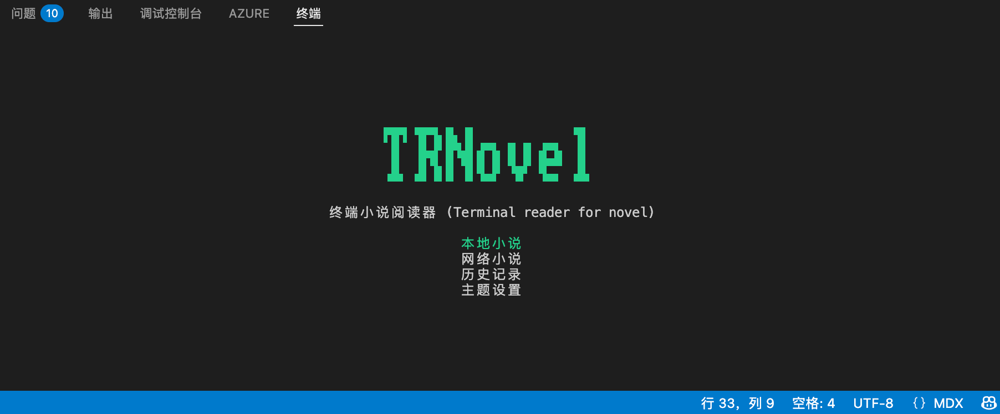
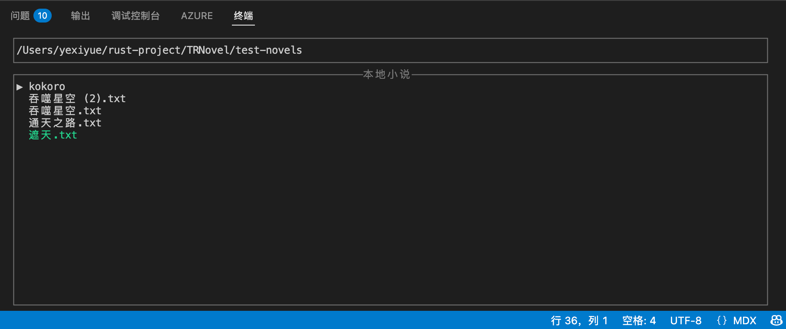
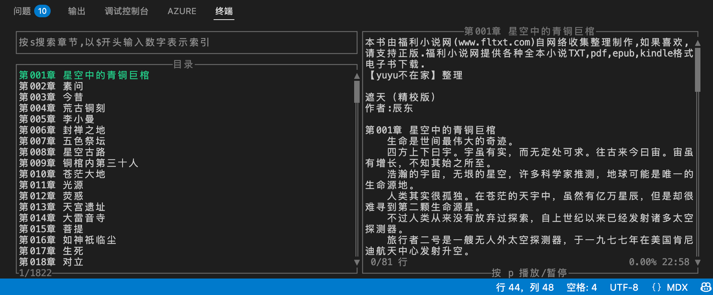
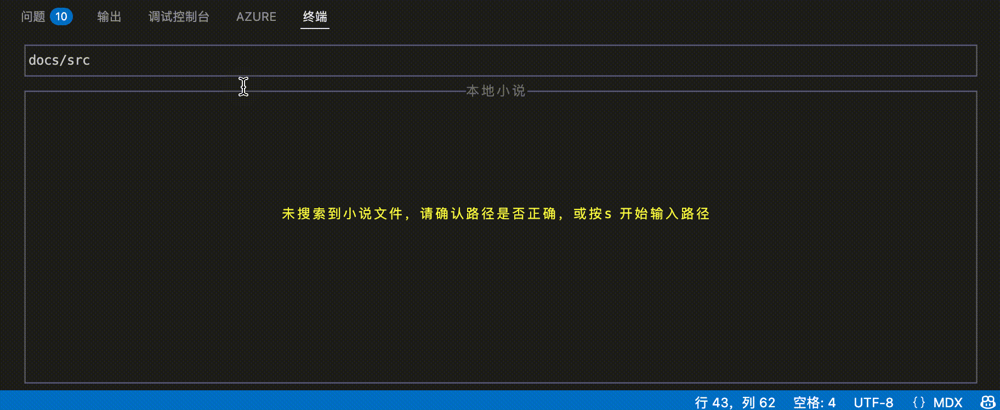

import { Steps, Tabs, TabItem } from "@astrojs/starlight/components";

本文将介绍如何使用 TRNovel 查找和阅读本地书籍。

## 基础使用

<Steps>

1. 打开终端，运行以下命令启动 TRNovel：
    <Tabs>
        <TabItem value="default" label="通用命令" icon="terminal">
            ```bash
            trnovel
            ```
        </TabItem>
        <TabItem value="short" label="简写命令" icon="terminal">
            ```bash
            trn
            ```
            :::caution[注意]
            只有通过包管理器安装 TRNovel 时，才可以使用该缩写命令。
            :::
        </TabItem>
    </Tabs>
    
2. 启动后将进入 TRNovel 的交互式界面，在此界面选择"本地书籍"选项。
    
    按回车键确认选择。
    
3. 选择"本地书籍"后，TRNovel 会自动扫描当前执行目录及其子目录下的所有 `.txt` 文件。
    
    
4. 在扫描结果中选择想要阅读的书籍，按回车键确认即可开始阅读。
    
</Steps>

## 进阶使用

如需扫描指定目录下的书籍，可以在进入"本地书籍"页面后，按下快捷键 `s`，然后输入目标目录路径并按回车确认。



:::note[提示]
通过路径查找书籍时，系统会保存该路径为历史记录，方便下次快速访问。
:::

:::tip[技巧]
您也可以在启动 TRNovel 时，通过命令行参数直接指定扫描目录，例如：
```bash
trnovel -l /path/to/your/books
```
:::