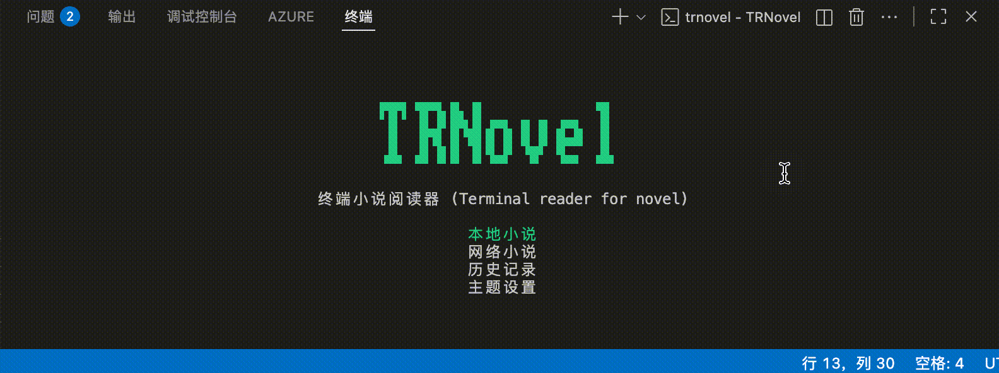

在阅读本地或网络小说时，系统会自动记录您的阅读进度。您可以在"历史记录"页面查看和管理这些记录。

## 访问历史记录

您可以通过以下两种方式进入历史记录页面：
- 在主页选择"历史记录"选项
- 通过命令行执行 `trnovel -H` 命令

在历史记录页面，选中一条历史记录并按回车键，即可进入该小说的章节列表继续阅读。

根据小说类型的不同，系统会跳转到相应界面：
- 本地小说：直接进入阅读界面
- 网络小说：进入书籍详情页面

:::tip[技巧]
您可以通过 `trnovel -q` 命令快速继续上次的阅读。
:::

## 删除历史记录

删除历史记录的操作流程与[删除书源](/TRNovel/guides/network#删除书源)类似。