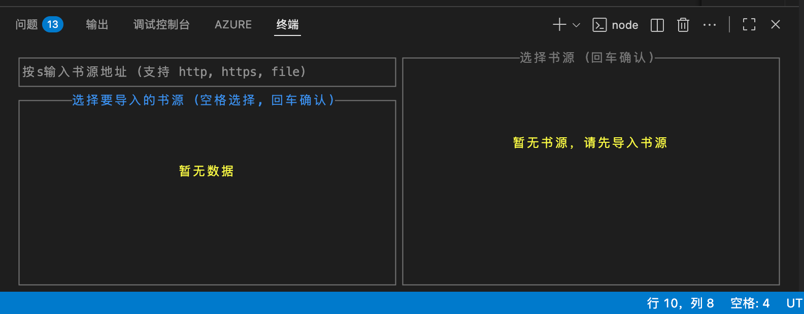
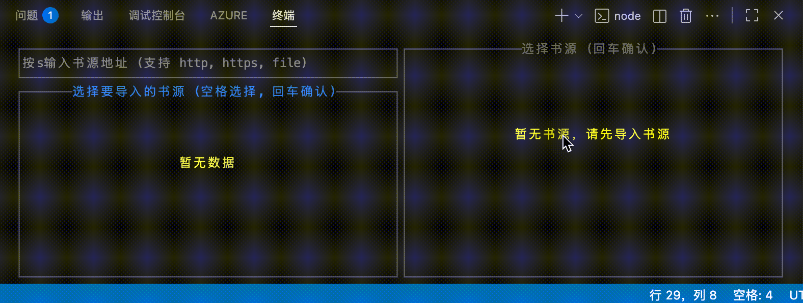
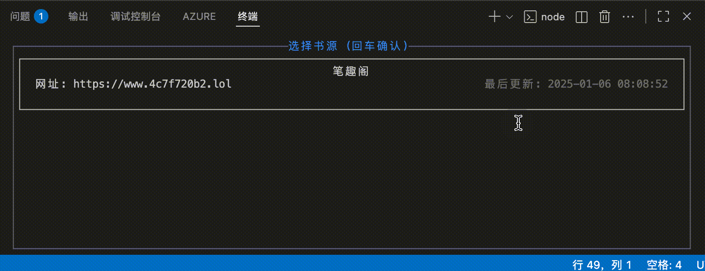
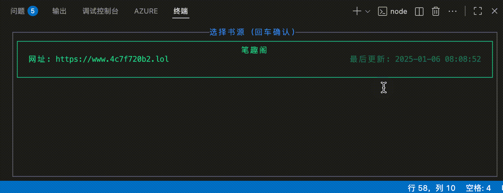
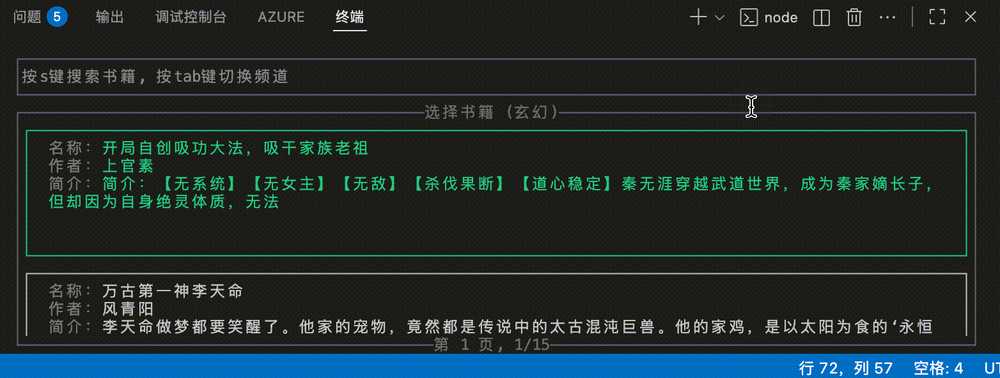
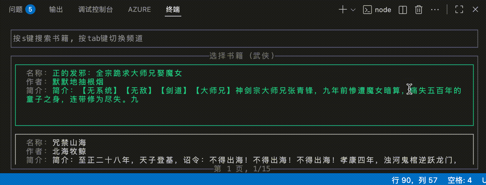

import { Steps } from "@astrojs/starlight/components";

## 书源管理

书源是一个 JSON 配置文件，用于获取网络小说内容。有关书源的详细信息，请参考[书源](/TRNovel/book-source/intro/)。

### 添加书源
<Steps>
1. 进入网络小说页面

    您可以在主页选择网络小说，或者通过命令行 `trnovel -n` 进入网络小说页面。
    

    :::note
    首次进入网络小说页面时，如果没有书源，系统会提示您添加书源。再次进入网络小说页面时，可以通过按 `Tab` 键进入添加书源模式。
    :::
    
2. 添加书源

    下面提供了测试书源，您可以直接复制粘贴使用：
    ```
    https://yexiyue.github.io/TRNovel/test.json
    ```
    
    操作流程:
    1. 按 `s` 输入书源 URL 地址或者文件路径
    2. 按回车键确认
    3. 等待书源解析完成
    4. 按上下键选择书源，按空格键选中书源
    5. 按回车键完成添加
    6. 按 `Tab` 键返回列表模式

    添加书源示例：
    

</Steps>

### 删除书源

删除书源操作流程:
1. 在书源列表模式下，使用上下方向键选择要删除的书源
2. 按 `d` 键删除选中的书源，此时会弹出一个确认框
3. 按 `y` 键确认删除，按 `n` 键取消删除，或者按 `Esc` 键退出确认框。您也可以按左右方向键选择"确认"或"取消"选项，然后按回车键确认。

删除书源示例：


## 搜索小说

### 频道
频道是书源提供的小说分类列表，您可以通过频道浏览不同类型的小说。
在书源列表模式下，选中一个书源，按回车键进入该书源的频道列表模式。

切换频道操作流程:
1. 按 `Tab` 键切换频道列表模式
2. 使用上下方向键选择频道
3. 按回车键进入选中的频道

频道示例：


:::note[浏览书籍列表]
您可以按上下方向键浏览书籍列表，按左右方向键翻页。
由于是通过书源获取的书籍列表，可能会出现内容重复的情况，请根据需要选择，避免盲目翻页。
:::

### 搜索
搜索操作流程:
1. 按 `s` 输入小说关键字
2. 按回车键开始搜索

搜索示例：


:::note[返回频道列表]
您可以清空输入框，然后按回车键返回频道列表。或者在输入模式下按 `Esc` 键会自动清空输入框并返回频道列表。
:::

## 书籍详情
选中一个书籍，按回车键进入书籍详情模式。
书籍详情页面显示书籍的详细信息，包括作者、简介等。
再次按回车键进入阅读模式，操作方式与本地书籍阅读模式相同。

详情示例：
