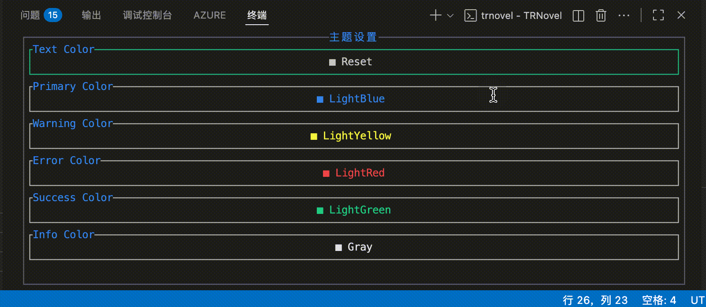
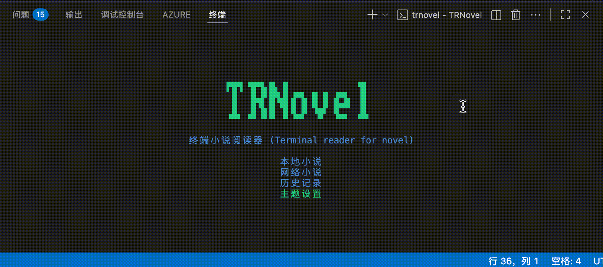

import { Steps } from "@astrojs/starlight/components";

本文将介绍如何使用 TRNovel 的主题设置功能。

<Steps>
1. 进入主题设置页面

    您可以在主页选择"主题设置"选项进入设置页面。

2. 设置主题色

    TRNovel 的主题是根据一组主题色进行配置的，因此主题设置功能主要是设置这些主题色。

    TRNovel 提供以下几种颜色配置：
    - Text Color: 文字颜色
    - Primary Color: 主要颜色
    - Warning Color: 警告颜色
    - Error Color: 错误颜色
    - Success Color: 成功颜色
    - Info Color: 信息颜色

    首先使用方向键选择要设置的颜色项，按回车键进入颜色选择模式。

    您可以通过以下方式更改主题色：
    - 使用方向键选择预设颜色，按回车键确认
    - 按 `s` 键输入颜色名称或者 HEX 格式的颜色值

    
</Steps>

## 恢复默认主题

您可以通过按 `d` 键恢复默认主题配置。系统会弹出确认框，您可以：
- 按 `y` 键确认恢复
- 按 `n` 键取消恢复
- 按 `Esc` 键退出确认框
- 使用左右方向键选择"确认"或"取消"选项，然后按回车键确认

