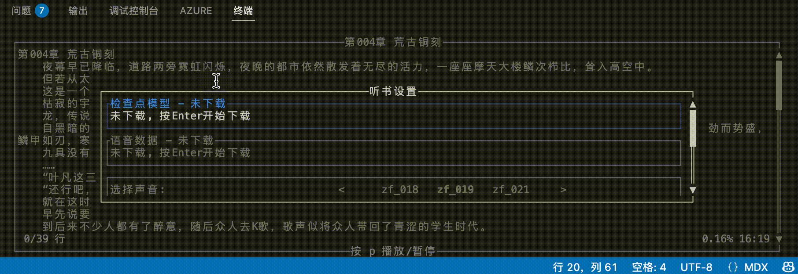

import { Steps, Tabs, TabItem } from "@astrojs/starlight/components"

本文将介绍如何使用 TRNovel 的听书功能。

听书功能基于 Kokoro TTS 模型将小说文本转换为语音播放，使用该功能前需要安装 Kokoro TTS 模型。

<Steps>
    1. 安装 Kokoro TTS 模型
        <Tabs>
            <TabItem value="auto" label="自动下载">
                进入阅读界面后，按 `T` 键打开听书设置界面，使用上下方向键选择相应选项，按回车键下载检查点模型和语音数据。
                
            </TabItem>
            <TabItem value="manual" label="手动下载">
                <Steps>
                    1. 下载模型文件：[kokoro-v1.1-zh.onnx](https://github.com/mzdk100/kokoro/releases/download/V1.1/kokoro-v1.1-zh.onnx)
                    2. 下载语音数据：[voices-v1.1-zh.bin](https://github.com/mzdk100/kokoro/releases/download/V1.1/voices-v1.1-zh.bin)
                    3. 将下载的文件放置到模型目录下`$HOME/.novel-tts/kokoro`，不同操作系统的路径如下：
                        <Tabs>
                            <TabItem label="Windows">
                                模型目录：
                                `C:\Users\{用户名}\.novel-tts\kokoro`
                            </TabItem>
                            <TabItem label="macOS">
                                模型目录：
                                `/Users/{用户名}/.novel-tts/kokoro`
                            </TabItem>
                            <TabItem label="Linux">
                                模型目录：
                                `/home/{用户名}/.novel-tts/kokoro`
                            </TabItem>
                        </Tabs>
                        
                        
                    4. 打开听书设置界面，确认模型和语音数据已被正确识别。
                        
                </Steps>
            </TabItem> 
        </Tabs>

        当听书设置页面中的"检查点模型"和"语音数据"均显示为已下载状态时，表示安装成功，可进行下一步操作。

    2. 开始听书
        
        再次按 `T` 键切换到阅读模式，按 `P` 键播放/暂停。
        
</Steps>

## 听书设置说明

听书设置界面包含以下选项：
- 检查点模型：显示当前使用的 TTS 模型文件状态
- 语音数据：显示当前使用的语音数据文件状态
- 选择声音：选择不同的声音数据，影响语音的音色
- 播放速度：调整播放速度
- 音量：调整播放音量
- 自动播放：进入阅读界面后自动开始播放，播放结束后自动跳转到下一章

操作说明：
- 使用上下方向键选择不同选项
- 按回车键确认选择或开始下载
- 按左右方向键调整播放速度、音量或切换声音

:::note[致谢]
感谢 [mzdk100](https://github.com/mzdk100) 提供的 [`kokoro-tts`](https://github.com/mzdk100/kokoro) crate 和 Kokoro 模型支持。
:::