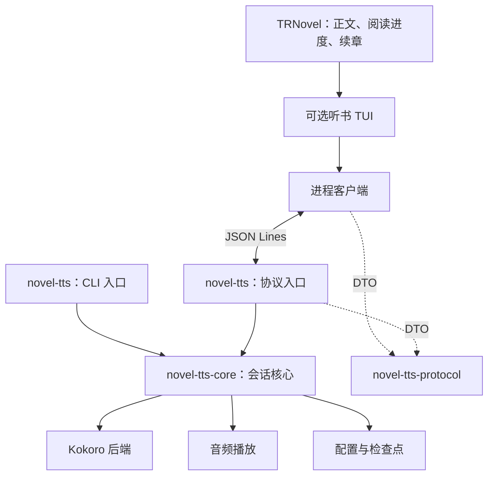

# Design

## Context

动机及用户确认范围见 `proposal.md`。当前 `NovelTTS` 同时持有 `Arc<KokoroTts>` 和 `rodio::OutputStream`，通过手写 unsafe Send/Sync 放入全局 atom；阅读页直接创建 `ChapterTTS`、播放器及游离进度任务。`ChapterTTS` 按 200 UTF-8 字节分段，将音频放入无界 Vec，错误直接跳过，末段失败时没有完成标记。`TTSConfig` 在根 App 加载并通过 Drop 保存，类型直接引用 Kokoro Voice。

现有 durable specs 只有 reader-paging 和 reader-settings-panel；后者的面板互斥要求需要为基础构建增加条件。根包有 trnovel/trn 两个入口，发布依赖 cargo-dist 0.32.0，ARM64 musl 使用自定义 Alpine job。保持 kokoro-tts 0.3.1、ort rc.10、rodio 0.21.x、动态 MSVC CRT 与模型目录，不在此次重构中升级原生依赖。

## Goals / Non-Goals

**Goals:** 阅读器、进程客户端和 UI 不接触音频/模型类型；CLI 和协议入口复用相同状态机；原文坐标、结束原因及配置所有权明确；打包后无需用户手动拼装程序。

**Non-Goals:** 本轮没有运行时插件 ABI、常驻服务、远程音频传输或逐字对齐。后端接口为将来扩展保留格式和能力信息，但只实现 Kokoro，不提前承诺其他模型的控制能力。

## Decisions

### 1. Workspace 分层与命名

按用户确认的命名，将原听书库移为 `crates/novel-tts-core`；`crates/novel-tts` 提供 CLI 和协议入口，可执行文件同名 `novel-tts`。轻量 `crates/novel-tts-protocol` 保存版本化 DTO 和原文位置类型，只依赖序列化等轻量库。依赖键使用 `tts-core` / `tts-protocol`，Rust 引用为 `tts_core` / `tts_protocol`。CLI 保留原 `novel-tts` 的 0.3.0 版本线，后续发布按既有流程递增。

`novel-tts-core` 内按 backend/session/player/text/models/config/checkpoint 划分模块，以模块名.rs 定义模块；仅有子模块时再建立同名目录，子模块放在该目录内。后端接口接受文本和后端音色 ID，返回 PCM、采样率、声道及片段标识；Kokoro 具体类型留在适配实现内。音频设备归播放器所有，在其允许的线程中管理，不延续把整个音频句柄强行标成 Send/Sync 的跨层设计。

TRNovel 的客户端与 TUI 放在独立可选 `src/tts.rs` 与 `src/tts/` 模块中，公开正文提交、控制、状态和事件接口；根 App 仅装配模块，阅读页不直接操作 stdio 或进程。首版不另建通用 UI 插件框架。

相较同进程 optional 模型库，子进程真正隔离推理和音频故障；轻量协议 crate 避免为了共享 DTO 又把原生依赖带回阅读器。

### 2. CLI 与传输模式

CLI 示例 `novel-tts book.txt`，首版支持 UTF-8 文本文件、状态展示和简单终端按键；非交互输入不启用终端原始模式，Ctrl+C 停止并退出。不增加独立完整 TUI。CLI 使用核心会话，不启动第二层子进程。

协议模式 `novel-tts --protocol` 不接管终端、不读取按键；stdin/stdout 只做 UTF-8 JSON Lines，serde 负责正文换行转义。stderr 日志单独有界排空，任何下载/推理库输出也不得污染 stdout。阅读器连续读取事件，并独立发送命令，避免等待命令响应时阻塞播放事件。

首条 hello/welcome 协商主版本及能力，不以两个程序的包版本必须相等代替协议兼容。主版本不匹配、非法消息、消息超限、握手超时返回结构化错误或关闭连接，UI 给出可操作信息。正文请求上限提案默认 16 MiB（编码后单行），握手超时 5 秒；这些限制统一定义并可在兼容范围内调节。stdin EOF 触发停止、检查点落盘和退出，即使父进程异常结束也不留下持续播放的孤儿。

命令 envelope 带 protocol_version、request_id、type、payload；会话命令还带 session_id。事件带进程实例 ID、会话 ID、单调序号；响应回显 request_id，异步进度不伪装成命令响应。区分命令接受成功与操作实际完成。重复 request_id 不重复创建会话。一个协议进程只维护一个播放会话。

| 命令组 | 作用 |
| --- | --- |
| hello、get_status | 握手、能力和实际状态 |
| get_config、update_config | 查询和校验保存配置 |
| prepare_model、cancel_prepare | 查询资源、按用户启用操作下载、进度与取消 |
| start、pause、resume、stop、seek | 提交正文、控制播放、按原文位置跳转 |
| shutdown | 停播、保存并释放模型/音频后退出 |

事件包括 ready、config_changed、model_progress、session_state、segment_started、segment_finished、session_ended、error。session_ended.reason 为 completed/cancelled/failed；只有 completed 表示正文已正常播完。音频留在子进程，不通过 JSON 传 PCM。

### 3. 生命周期和恢复状态机

阅读器无听书操作时不启动进程；首次打开需要实际状态的听书面板或播放时按需启动，但查看面板不加载/下载模型或开始播放。握手后 idle，用户启用播放时加载模型。切章、切音色或 seek 用新 session_id 替代旧会话；取消生成、清队列，并使旧进度/完成事件失效。父端同时核对进程实例 ID、会话 ID 和正文摘要。

pause 保留播放位置并暂停消费，预取达到预算后停止；stop 取消生成并清空队列，但保留模型和恢复点。release/shutdown 关闭程序。正常退出先 shutdown，等待有界期限（提案默认 3 秒），然后终止并回收进程；异常退出和协议 EOF 同样结束音频、后台任务及下载。只有用户明确重试才重启失败进程，不建立无限自动重启循环。

失败停止会话并报告阶段、错误码及是否可重试；不跳过失败片段。生成结束与播放耗尽分别跟踪，空白正文立即正常结束，最后片段失败和取消都产生一次终态。事件不能阻塞音频回调；控制任务接收回调信号再发协议消息。

TRNovel 根据正常 completed 事件和配置快照的 auto_play 决定获取下一章；自动续章仅延续本次已主动开始的听书，不使重启后的检查点自行播放。CLI 则处理单个文件的正文，不引入书源/阅读器状态。

### 4. 预取、高亮与恢复坐标

保留原始章节正文，摘要按完全相同 UTF-8 字节计算，原文坐标为章内左闭右开字节范围，验证 Unicode 边界。初版保留 Kokoro 分段行为作为基线，但稳定恢复坐标独立于分段编号。听书状态由播放开始/结束事件更新，不由合成完成更新；保持搜索高亮优先规则。

队列同时按音频时长和字节数限制预取；已消费音频释放，暂停也不无限生成。初版不要求持久音频缓存，回跳到已释放片段时重合成；重新分段时定位包含恢复字节位置的片段，从其开头播放。seek 走新会话，不能以 Vec 下标当永久片段 ID。播放倍速继续走播放层，音量也不参与合成参数，保持旧 speed/volume 行为。

检查点由听书程序保存，最小内容：schema_version、来源命名空间、稳定书/章节或文件 ID、正文摘要、恢复字节位置和更新时间。阅读器提供稳定来源 ID 与正文，CLI 用文件来源命名空间；两者不互相覆盖。正常片段开始保存其起点，完成后推进到下一片段；原子替换写盘，因此崩溃后最多从最近持久化片段开头重复。正常整章完成记录终态，避免重启误认为尚待恢复。位置文件放在 `~/.novel/tts/` 独立目录，不修改阅读历史和进度文件；不强制持久化整章正文。

正文哈希不同、字节位置非法或未知 schema 主版本均不得静默套用位置；返回检查点失效提示，用户可以主动从头开始。进程因失败重启时父端可提交最后确认位置，但仍校验摘要。片段级恢复可能重复少量文字，这是明确取舍，不承诺音频采样级恢复。

### 5. 配置兼容与唯一写入职责

将 `src/cache/tts.rs` 中持久化职责移到核心；阅读器保存配置快照只用于 UI，不带 Drop::save，也不直接读写听书配置。原文件路径和四个旧字段 volume/speed/voice/auto_play 保持可读及兼容写入，缺 backend 解释为 Kokoro；新增字段按命名空间放置，旧 Voice 枚举在适配层转换成稳定音色 ID。

保存前保留未识别后端字段，后端不可用时提示而不重置用户选择；损坏配置报错且不以默认值覆盖。更新经过范围及音色校验、磁盘原子替换后确认成功，再发配置事件。CLI 与多个阅读器实例可能并存：共享文件短锁和修订号，更新时重读合并或报告 revision_conflict；锁仅覆盖事务，不把独占锁持有整个进程生命周期。这个约束不引入共享常驻服务。

读取旧文件前不能创建带 Drop 保存的默认对象，避免初始化过程中覆盖旧文件。新模型与听书位置仍独立于阅读格式，基础阅读版不触碰任何听书持久化文件。

### 6. Feature 与发行

根应用 feature `tts` 只开启 UI、轻量协议及进程管理；`novel-tts` 引入听书核心，Kokoro 后端在核心以 `kokoro` feature 管理。源码默认开启根 tts 以保持现有入口的可发现性，基础构建使用 `cargo build -p trnovel --no-default-features`；这是提案默认，基础/听书发行包必须明确标识。两种阅读器的应用依赖树都不得含听书引入的 rodio/kokoro-tts/ort。

阅读器查找顺序：用户配置的明确程序路径 → 当前可执行文件同目录 `novel-tts[.exe]` → PATH。显式路径无效时直接报错，防止误用其他版本。缺少程序或协议不兼容只影响听书，不阻塞阅读启动。程序路径属于阅读器启动配置，不能依靠尚未找到的子进程查询；不使用 shell 拼接启动命令。

基础包提供 trnovel/trn；听书包提供启用 tts 的 trnovel/trn 与 novel-tts，模型不随包分发。保留现有安装渠道的听书体验，通过新增明确基础版制品/安装选项选择轻量版。调整 cargo-dist 元数据并 regenerate；若 pinned dist 对同包双 feature 制品不能表达，使用已采用的 custom artifact job 构建基础版制品并接入 release 和安装选择，不手改生成 workflow。各渠道必须验证安装后同目录发现和两种变体，不能只发布两个压缩包而继续让所有安装器选择同一变体。

平台保持 Windows MSVC、Linux GNU、Apple Silicon 和 Intel Mac；musl 自定义 job 分开构建两种阅读器和听书程序，原 ORT/ALSA 共享库要求只属于听书程序，基础阅读版不得要求用户安装听书运行库。

## Risks / Trade-offs

- [第三方输出污染 stdout] → 协议集成测试扫描每行、初始化和下载阶段也覆盖，日志统一 stderr。
- [音频回调消费与设备实际出声略有延迟] → 首版只承诺片段级高亮，实机验证暂停/倍速；不宣称逐字同步。
- [崩溃发生在检查点写入之前] → 片段边界及时原子落盘，恢复允许重复最近片段但不跳过。
- [保留模型占用内存] → 显式释放入口、有界音频队列；不因暂停自动卸载。
- [多个实例修改共享配置] → 短锁、修订校验与冲突报告，用户配置不被静默覆盖。
- [双发行包扩大构建矩阵] → 分离 package-specific 依赖验证和 workspace 全功能检查，覆盖安装器、musl 及动态库依赖。
- [库公开 API 变化] → 更新示例及版本说明，按仓库发布约定准备兼容版本；本变更不直接发布。

## Migration Plan

1. 冻结当前 Kokoro 分段/音色/播放行为基线与旧配置 fixtures，先定义协议和状态机，再重构核心。
2. 新程序实现两种入口及配置/检查点，移除对阅读器的反向依赖；后接入阅读器模块并去掉模型句柄、播放器与配置文件写入。
3. 增加 root tts feature、键位和帮助过滤以及基础构建兼容；更新现有 reader-settings-panel 互斥规格。
4. 生成两种发行制品与安装选择，先验证协议/配置/恢复测试和各平台安装再发布。用户主动启用时才下载缺少资源。
5. 回退阅读器与听书程序应成对回退；旧四字段及模型路径仍在，旧版本可继续读取旧设置。新检查点文件由旧版本忽略，阅读进度格式不变；不得以回退为由删除模型、配置或检查点。
